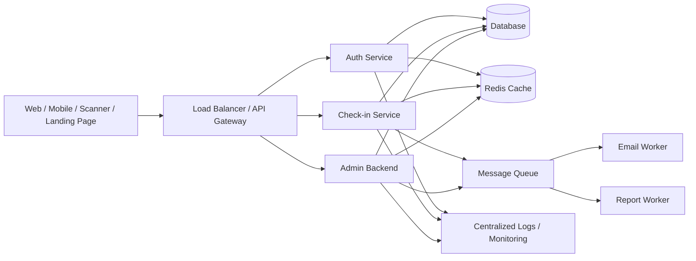

# Check-in V4 - BRD/SRS & API Documentation

Tài liệu này gộp nội dung từ 2 tài liệu nguồn: **BRD/SRS cho dự án Check-in V4** và **API Documentation v1**. Nội dung đã được chuẩn hóa lại theo định dạng Markdown để thuận tiện lưu trữ trong repository, dùng cho BA/PM/dev team và làm context cho AI coding agent.

## Mục lục

- [Phần 1 - BRD/SRS](#phần-1---brdsrs)
- [Phần 2 - API Documentation](#phần-2---api-documentation)
- [Phụ lục - Ghi chú triển khai](#phụ-lục---ghi-chú-triển-khai)

---

# Phần 1 - BRD/SRS

## 1. Giới thiệu

Dự án **Check-in V4** là hệ thống check-in/check-out dành cho sự kiện, hội thảo và chiến dịch marketing. Ứng dụng giúp doanh nghiệp quản lý khách mời, gửi mã QR, quét check-in theo thời gian thực, cấu hình màn hình check-in và xuất báo cáo.

Hệ thống hiện đang ở dạng monolithic Laravel/PHP, gồm API, giao diện quản trị và xử lý cơ sở dữ liệu. Tài liệu này định hướng lại yêu cầu nghiệp vụ và yêu cầu phần mềm để phục vụ việc tách hệ thống theo hướng dễ bảo trì, dễ mở rộng và phù hợp mô hình SaaS đa tenant.

### 1.1 Thành phần tài liệu

| Thành phần | Mục đích |
|---|---|
| BRD - Business Requirements Document | Mô tả yêu cầu nghiệp vụ, người dùng, vai trò và phạm vi dự án. |
| SRS - Software Requirements Specification | Mô tả yêu cầu kỹ thuật, API, mô hình dữ liệu, phân quyền, bảo mật và hiệu năng. |

## 2. Phạm vi dự án - BRD

### 2.1 Đối tượng người dùng và vai trò

Hệ thống áp dụng mô hình SaaS đa tenant với 3 nhóm vai trò chính.

#### Cấp hệ thống - System

| Vai trò | Mô tả |
|---|---|
| System Admin | Quyền toàn diện, cấu hình hệ thống, tạo công ty/tenant, phân quyền và gán vai trò. Mô hình RBAC dùng Spatie Permission và có thể dùng `Gate::before` để cấp super admin. |
| System Audit | Truy cập logs, giám sát sự cố, không được sửa dữ liệu nghiệp vụ. |
| System Support | Hỗ trợ kỹ thuật, xem cấu hình và logs, không có quyền tạo/sửa dữ liệu quan trọng. |

#### Cấp công ty - Tenant

| Vai trò | Mô tả |
|---|---|
| Company Admin | Tạo và quản lý sự kiện, khách mời, người dùng, phân quyền nội bộ. |
| Manager | Quản lý event hoặc campaign, cấu hình màn hình check-in, xuất báo cáo. |
| User | Nhân viên hỗ trợ đăng ký hoặc quét check-in theo quyền được cấp. |

#### Cấp thiết bị

| Vai trò | Mô tả |
|---|---|
| Scanner | Thiết bị hoặc tài khoản dùng để gọi API quét mã QR. Xác thực bằng token và chỉ được xem trạng thái check-in liên quan. |

### 2.2 Mục đích và yêu cầu nghiệp vụ

1. **Tách biệt dịch vụ:** chuyển từ monolithic sang kiến trúc tách lớp hoặc microservice gồm Auth service, Check-in service, Admin backend và Database service để dễ bảo trì và mở rộng.
2. **Quản lý sự kiện:** tạo sự kiện với mã event, nội dung, ngày diễn ra, trạng thái, màu sắc, ảnh nền và các thiết lập vận hành.
3. **Quản lý khách mời/attendee:** mỗi khách có thông tin cơ bản như tên, email, điện thoại, loại khách mời và các trường tùy chỉnh theo event.
4. **Check-in/check-out:** xử lý quét mã QR, lưu thời gian quét, loại quét `CHECKIN`/`CHECKOUT`, trạng thái và dữ liệu liên quan.
5. **Chống check-in trùng:** middleware/service cần kiểm tra sự tồn tại của event, thiết lập cho phép trùng lặp và lịch sử quét trước đó.
6. **Offline & multi check-in:** hỗ trợ cache lượt quét offline và đồng bộ khi có kết nối; hỗ trợ gửi nhiều lượt check-in trong một request.
7. **Báo cáo & dashboard:** thống kê realtime tổng số đăng ký, số lượt check-in, tỷ lệ check-in, xuất CSV/Excel theo event hoặc công ty.
8. **Custom fields:** cho phép định nghĩa field tùy chỉnh theo event với type, thứ tự, bắt buộc, unique và hiển thị trên landing page/check-in.
9. **Phân quyền & bảo mật:** sử dụng RBAC, policies/middleware, HTTPS, CSRF protection cho web, token auth cho API và hashing mật khẩu.
10. **Hiệu năng & mở rộng:** API mục tiêu phản hồi nhanh cho phần lớn request, hỗ trợ tải lớn bằng cache, queue, worker và có thể dùng Laravel Octane.
11. **Giám sát & audit:** ghi log sự kiện và thao tác người dùng; hỗ trợ System Audit xem logs, activity log và cảnh báo hiệu năng/lỗi.

---

## 3. Đặc tả yêu cầu phần mềm - SRS

### 3.1 Kiến trúc hệ thống đề xuất



Kiến trúc đề xuất có API Gateway/Load Balancer nhận request và chuyển đến các service: Auth, Check-in và Admin. Mỗi service kết nối database và Redis. Các tác vụ nặng như gửi email, xuất báo cáo, xử lý import được đưa vào queue/worker. Toàn bộ hệ thống cần ghi log tập trung để audit và monitoring.

### 3.2 Yêu cầu chức năng

#### 3.2.1 Quản lý sự kiện - Event Management

| API | Mô tả | Ghi chú quyền |
|---|---|---|
| `POST /api/v1/events` | Tạo sự kiện mới với tên, mã event, mô tả, thời gian, trạng thái và settings. | Company Admin hoặc Manager. |
| `PUT /api/v1/events/{id}` | Cập nhật thông tin sự kiện. | Người có quyền quản lý event. |
| `DELETE /api/v1/events/{id}` | Soft delete sự kiện và ghi log. | Admin/Manager có quyền. |
| `GET /api/v1/events` | Danh sách sự kiện theo `company_id`, hỗ trợ phân trang và tìm kiếm. | Theo tenant/role. |
| `GET /api/v1/events/{id}` | Chi tiết sự kiện gồm settings, tỷ lệ check-in, danh sách khách mời. | Theo quyền truy cập event. |

#### 3.2.2 Quản lý khách mời/khách hàng - Client/Attendee Management

| API | Mô tả |
|---|---|
| `POST /api/v1/clients` | Tạo khách mời, nhận thông tin cơ bản, `event_id`, trạng thái đăng ký, custom fields; QR code có thể được tạo tự động. |
| `PUT /api/v1/clients/{id}` | Cập nhật thông tin khách mời. |
| `DELETE /api/v1/clients/{id}` | Soft delete khách mời và ghi lịch sử. |
| `POST /api/v1/clients/import` | Import CSV/Excel danh sách khách mời; xử lý qua queue và trả kết quả từng dòng. |
| `GET /api/v1/clients` | Danh sách khách mời theo `event_id`, trạng thái, tìm kiếm tên/email/QR, phân trang. |
| `GET /api/v1/clients/{id}` | Chi tiết khách mời. |

#### 3.2.3 Quét check-in/check-out

| API | Mô tả |
|---|---|
| `POST /api/v1/checkins/single` | Nhận `event_code` và `qrcode`, xác thực scanner token, kiểm tra event/client và ghi nhận check-in. |
| `POST /api/v1/checkins/checkout` | Tương tự check-in nhưng `type = CHECKOUT`. |
| `POST /api/v1/checkins/bulk` | Nhận danh sách `qrcode[]`, xử lý nhiều lượt quét và trả kết quả từng mã. |
| `POST /api/v1/checkins/offline-sync` | Đồng bộ lượt quét offline khi thiết bị có kết nối lại. |
| `GET /api/v1/checkins/statistics?event_id=` | Thống kê tổng đăng ký, check-in, check-out, tỷ lệ theo thời gian thực. |

Luồng check-in cần kiểm tra:

1. Token của scanner/user hợp lệ.
2. Event tồn tại và đang được phép vận hành.
3. QR code tồn tại trong event hoặc được cho phép check-in không đầu vào nếu event bật cấu hình này.
4. Nếu `allow_duplicate = false`, hệ thống cần kiểm tra lịch sử quét để chặn trùng.
5. Ghi bản ghi vào bảng `checkins` gồm `event_id`, `user_id`/`client_id`, `qrcode`, `scan_time`, `status`, `type`, `note`.
6. Trả về thông tin client và message tương ứng.

#### 3.2.4 Báo cáo và dashboard

Dashboard admin cần hiển thị:

- Tổng số khách mời.
- Số lượt check-in hiện tại.
- Tỷ lệ check-in so với đăng ký.
- Top thiết bị/cổng check-in nếu có.
- Biểu đồ check-in theo thời gian.
- Danh sách đăng ký hoặc check-in gần đây.

API báo cáo đề xuất:

| API | Mô tả |
|---|---|
| `GET /api/v1/reports/checkins?event_id=&format=csv` | Tạo file CSV/Excel danh sách check-in và thông tin khách mời; nên xử lý bằng queue khi dữ liệu lớn. |

---

## 4. Yêu cầu dữ liệu & mô hình cơ sở dữ liệu

### 4.1 Bảng `events`

| Trường | Kiểu dữ liệu | Mô tả |
|---|---|---|
| `id` | bigint, PK | Khóa chính. |
| `company_id` | bigint | Liên kết tenant. |
| `code` | string | Mã sự kiện duy nhất. |
| `name` | string | Tên sự kiện. |
| `start_date` / `end_date` | datetime | Thời gian diễn ra. |
| `status` | enum | Trạng thái: `NEW`, `ACTIVE`, `CLOSED`. |
| `settings` | json | Cấu hình event: `allow_duplicate`, background, theme... |
| `created_at` / `updated_at` | timestamp | Thời gian tạo/cập nhật. |

### 4.2 Bảng `clients` - attendees

| Trường | Kiểu dữ liệu | Mô tả |
|---|---|---|
| `id` | bigint, PK | Khóa chính. |
| `event_id` | bigint | Liên kết sự kiện. |
| `company_id` | bigint | Liên kết tenant. |
| `qrcode` | string | Mã QR duy nhất trong event. |
| `name` | string | Tên khách mời. |
| `email` | string | Email khách mời. |
| `phone` | string | Số điện thoại. |
| `status` | enum | Trạng thái đăng ký: `NEW`, `ACTIVE`, `CANCELED`. |
| `custom_fields` | json | Dữ liệu trường tùy chỉnh. |
| `created_at` / `updated_at` | timestamp | Thời gian tạo/cập nhật. |

### 4.3 Bảng `checkins`

| Trường | Kiểu dữ liệu | Mô tả |
|---|---|---|
| `id` | bigint, PK | Khóa chính. |
| `event_id` | bigint | Liên kết sự kiện. |
| `client_id` | bigint | Liên kết client nếu có. |
| `qrcode` | string | Mã QR được quét. |
| `scan_time` | datetime | Thời gian quét. |
| `status` | enum | `NEW`, `CHECKIN`, `DELETED`. |
| `type` | enum | `CHECKIN` hoặc `CHECKOUT`. |
| `device_id` | bigint | Thiết bị quét/scanner. |
| `note` | string | Ghi chú hoặc thông điệp. |
| `created_at` / `updated_at` | timestamp | Thời gian tạo/cập nhật. |

### 4.4 Các bảng phụ

| Bảng | Mô tả |
|---|---|
| `custom_field_templates` | Định nghĩa field tùy chỉnh với `type`, `options`, `order`, `required`, `unique`, cấu hình hiển thị. |
| `users` | Người dùng hệ thống; dùng Spatie Permission để gán roles/permissions. |
| `devices` | Thiết bị scanner, token truy cập và trạng thái thiết bị. |

---

## 5. Yêu cầu phi chức năng

### 5.1 Bảo mật

- Sử dụng HTTPS, TLS và HSTS.
- Mật khẩu được hash bằng Bcrypt hoặc cơ chế hash chuẩn của Laravel.
- Web dùng CSRF protection.
- API dùng JWT hoặc Laravel Sanctum token.
- Token nên có thời hạn, cơ chế revoke/refresh an toàn.
- RBAC với Spatie Permission; dùng policies/middleware để kiểm soát quyền.
- Dùng `Gate::before` thận trọng cho Super Admin.
- Chống SQL injection bằng query binding/ORM.
- Escape output để giảm rủi ro XSS.
- Bảo vệ session: ID ngẫu nhiên, mã hóa, hết hạn hợp lý.
- Rate limit login và API quan trọng.
- Ghi log hành động bất thường.

### 5.2 Hiệu năng và mở rộng

- Cache dữ liệu cấu hình bằng Redis/Memcached.
- Cache truy vấn thường dùng bằng `cache()->remember()` khi phù hợp.
- Dùng `route:cache` và `config:cache` ở môi trường production.
- Tác vụ nặng như gửi email, import, export báo cáo phải chạy qua queue/worker.
- Tối ưu query: chỉ lấy field cần thiết, dùng eager loading, phân trang, index hợp lý.
- Cân nhắc Laravel Octane với Swoole/RoadRunner cho API có tải cao.
- Index các trường tìm kiếm và join thường dùng như `event_id`, `qrcode`, `scan_time`.
- Hỗ trợ HA bằng backup tự động, replication và scale horizontal qua load balancer.

### 5.3 Giám sát và audit

- Ghi log request, lỗi hệ thống và sự kiện nghiệp vụ quan trọng.
- Có role System Audit chỉ xem log, không sửa dữ liệu.
- Lưu lịch sử thao tác bằng activity log.
- Theo dõi hiệu năng bằng Prometheus/Grafana hoặc dịch vụ tương đương.
- Thiết lập alert khi API chậm, queue backlog cao hoặc lỗi tăng bất thường.

### 5.4 Phụ lục nghiệp vụ

#### Thông điệp và mã QR

Khi quét mã QR, hệ thống trả về thông điệp theo cấu hình event, ví dụ:

- `Đã check-in thành công`.
- `Bạn đã check-in trước đó`.
- `Không tìm thấy khách mời`.

Mã QR được tạo khi thêm client và chứa mã khách hoặc chuỗi định danh liên kết với client/event.

#### Hướng mở rộng tương lai

- Tích hợp thêm email/SMS marketing.
- Hỗ trợ push notification.
- Quản lý vé điện tử.
- Tích hợp CRM.
- Chuẩn hóa API Gateway để quản lý version, rate-limit và policy.

---

# Phần 2 - API Documentation

## 1. Tổng quan API

API Check-in V4 cung cấp các endpoint REST cho authentication, check-in, quản lý client/guest, language resources, assets, page access logs, landing page và webhook Postmark.

Base URL mặc định:

```text
https://{your-domain}/api/v1
```

Hệ thống giả định mô hình SaaS đa tenant. System Admin kiểm soát tenant/company; Company Admin, Manager và User truy cập API theo role/permission. Authentication dùng Laravel Sanctum token trả về từ endpoint authenticate. Các request cần xác thực phải gửi token theo header:

```http
Authorization: Bearer <token>
```

Một số endpoint public không yêu cầu token, ví dụ language files, landing page public hoặc assets tùy cấu hình.

---

## 2. Authentication

### 2.1 Login và lấy token

| Thuộc tính | Giá trị |
|---|---|
| Method | `POST` |
| URL | `/authenticate` |
| Mục đích | Xác thực user bằng email/password và trả về Sanctum access token cùng thông tin user. |

#### Request body

| Field | Type | Required | Description |
|---|---|---|---|
| `email` | string | yes | Email user, validate dạng lowercase email. |
| `password` | string | yes | Password tài khoản. |

#### Validation & security

- Request được validate bởi `LoginRequest`.
- Bắt buộc có `email` và `password`.
- Rate-limit login để giảm brute force.
- Khi thành công, controller tạo token bằng `createToken('api_token')` và trả về trong `meta.access_token`.
- Khi thất bại, trả HTTP `401` với message `This action is unauthorized.`.

#### Response 200

```json
{
  "data": {
    "id": 1,
    "name": "John Doe",
    "email": "john@example.com"
  },
  "meta": {
    "access_token": "<long-sanctum-token>"
  }
}
```

---

## 3. Check-in API

### 3.1 Single check-in

| Thuộc tính | Giá trị |
|---|---|
| Method | `POST` |
| URL | `/checkin` |
| Mục đích | Scan một QR code và ghi nhận check-in cho event cụ thể. |

#### Headers

| Header | Required | Description |
|---|---|---|
| `Authorization: Bearer <token>` | yes | Token của user/device đã xác thực. |
| `User-Agent` | no | Có thể dùng `WebPortal`, `PDA`, `MobileApp` để phân loại scanner type. |

#### Request body

| Field | Type | Required | Description |
|---|---|---|---|
| `event_code` | string | yes | Mã event, phải tồn tại trong `events.code`. |
| `qrcode` | string | yes | QR code cần quét; alphanumeric và có thể gồm `-+_#$*%`; không có khoảng trắng. |
| `scan_time` | string/datetime | no | Format `YYYY-MM-DD HH:MM:SS`; nếu bỏ trống server dùng thời gian hiện tại. |

#### Response

Success 200:

```json
{
  "status": true,
  "msg": "Check-in thành công",
  "data": {}
}
```

Error 400-404:

```json
{
  "status": false,
  "msg": "Invalid event code or QR code"
}
```

Lỗi có thể xảy ra khi event code không tồn tại, QR không hợp lệ, QR đã check-in hoặc validation fail.

### 3.2 Bulk/multi check-in

| Thuộc tính | Giá trị |
|---|---|
| Method | `POST` |
| URL | `/multi-checkin` |
| Mục đích | Gửi nhiều lượt check-in trong một request. |

Headers giống single check-in.

#### Request body

| Field | Type | Required | Description |
|---|---|---|---|
| `event_code` | string | yes | Mã event. |
| `total_records` | integer | no | Số record kỳ vọng, dùng cho reporting. |
| `data` | array | yes | Danh sách object check-in. |
| `data[].qrcode` | string | yes | QR code của từng entry. |
| `data[].scan_time` | string/datetime | no | Thời gian scan của từng entry. |

#### Response

- Success 200: trả về danh sách kết quả từng record, gồm status/message thành công hoặc thất bại.
- Error: trả `status: false` kèm validation messages nếu thiếu field hoặc field không hợp lệ.

---

## 4. Client Management API

Nhóm endpoint này xử lý đăng ký, tra cứu và cập nhật thông tin client/guest. Nhiều thao tác phụ thuộc `custom_fields` được định nghĩa ở cấp event.

### 4.1 Find client

| Thuộc tính | Giá trị |
|---|---|
| Method | `GET` |
| URL | `/clients/find` |
| Mục đích | Tìm client theo event và thuộc tính định danh như QR code hoặc ID. |

#### Query parameters

Ít nhất một identifier cần được cung cấp.

| Parameter | Type | Required | Description |
|---|---|---|---|
| `event_id` | integer | no | Event ID, phải tồn tại trong `events.id`. |
| `event_code` | string | no | Event code, tồn tại trong `events.code`. |
| `qrcode` | string | no | QR code của client, tồn tại trong `clients.qrcode`. |
| `id` | integer | no | Client ID, tồn tại trong `clients.id`. |

#### Response

- Success 200: trả client và event liên quan theo resource `ClientWithEvent`.
- Error 404: trả message `Không tìm thấy khách mời` nếu client/event không tồn tại.

### 4.2 Generate QR code theo event settings

| Thuộc tính | Giá trị |
|---|---|
| Method | `GET` |
| URL | `/clients/generate-qrcode-on-setting/{event}` |
| Mục đích | Tạo QR code cho guest theo QR settings của event. |

`{event}` là ID của event.

#### Query/body parameters

| Field | Type | Required | Description |
|---|---|---|---|
| `name` | string | yes | Tên khách mời. |
| `email` | string | no | Email khách mời. |
| `custom_fields` | object | no | Key-value custom field, có thể gồm `phone` hoặc field dùng để sinh QR. |

Endpoint trả về chuỗi QR code. Dùng khi cần tạo QR trước nhưng chưa đăng ký client ngay.

### 4.3 Register client

| Thuộc tính | Giá trị |
|---|---|
| Method | `POST` |
| URL | `/clients/register` |
| Mục đích | Tạo hoặc cập nhật client/guest, có thể tự sinh QR code. Thường dùng cho landing page. |

#### Headers

| Header | Required | Description |
|---|---|---|
| `Authorization: Bearer <token>` | tùy luồng | Bắt buộc nếu đăng ký qua API authenticated. |

#### Request body

| Field | Type | Required | Description |
|---|---|---|---|
| `id` | integer | no | Client ID nếu cập nhật client hiện có. |
| `event_code` | string | yes | Mã event. Nếu không tìm thấy trả `Không tìm thấy sự kiện`. |
| `qrcode` | string | no | QR tùy chỉnh; nếu bỏ trống server tự sinh theo event settings. |
| `name` | string | no | Tên client. |
| `email` | string | no | Email client. |
| `status` | string | no | Trạng thái client, ví dụ `NEW`, `CHECKIN`... |
| `type` | string | no | Loại client, ví dụ `VIP`. |
| `custom_fields` | object | no | Giá trị field tùy chỉnh; validate theo custom field templates của event. |
| `lang` | string | no | Mã ngôn ngữ cho multi-language communication. |
| `ref_id` | integer | no | Reference ID để liên kết với external campaign. |
| `campaign_id` | various | no | Campaign liên quan nếu có. |
| `slug` | various | no | Landing page slug nếu có. |
| `card_id` | various | no | Card/thiệp/vé liên quan nếu có. |

#### Behavior

- Server xác định event từ `event_code` và populate `event_id`.
- Nếu `id` được gửi và trùng client hiện có, server cập nhật client.
- Nếu không có `id` phù hợp, server tạo client mới.
- Một số event có logic tự sinh custom values như lucky number hoặc sequential code.
- File upload trong `custom_fields` được lưu vào thư mục uploads; chỉ chấp nhận file type theo custom field templates.
- Sau khi tạo/cập nhật, API sinh ảnh QR và chạy logic đăng ký theo event nếu có.

#### Response

- Success 200: trả client kèm event info và success message.
- Error 404: khi event hoặc user information không hợp lệ.

### 4.4 Upsert client by QR code

| Thuộc tính | Giá trị |
|---|---|
| Method | `POST` |
| URL | `/clients/upsert` |
| Mục đích | Tạo hoặc cập nhật client bằng `event_id` và `qrcode`. Dùng cho authenticated API users, scanner devices hoặc admin back-office. |

#### Headers

```http
Authorization: Bearer <token>
```

#### Request body

| Field | Type | Required | Description |
|---|---|---|---|
| `event_id` | integer | yes | Event ID. |
| `qrcode` | string | no | QR code; nếu thiếu server tự sinh theo event settings. |
| `name` | string | no | Tên client. |
| `email` | string | no | Email client. |
| `status` | string | no | Trạng thái client, phải thuộc allowed statuses. |
| `type` | string | no | Loại client, tối đa 50 ký tự. |
| `custom_fields` | object | no | Custom field values, validate theo event templates. |
| `lang` | string | no | Mã ngôn ngữ. |
| `ref_id` | integer | no | Reference ID. |
| `slug` | string | no | Landing page slug. |
| `campaign_id` | integer | no | Campaign identifier. |
| `card_id` | integer | no | Card identifier. |

#### Behavior

- Kiểm tra event tồn tại.
- Kiểm tra user có quyền API operation trên event.
- Nếu QR code đã tồn tại trong event, cập nhật client.
- Nếu chưa tồn tại, tạo client mới và sinh QR image.
- Trả client resource và success message.

### 4.5 Upsert client by ID

| Thuộc tính | Giá trị |
|---|---|
| Method | `POST` |
| URL | `/clients/upsert-by-id` |
| Mục đích | Tạo hoặc cập nhật client record theo ID. |

Parameters tương tự `/clients/upsert` nhưng bắt buộc có `id`.

| Field | Type | Required | Description |
|---|---|---|---|
| `id` | integer | yes | Client ID cần cập nhật. |
| `event_id` | integer | yes | Event ID. |
| Other fields | various | no | Giống `/clients/upsert`: `name`, `email`, `status`, `type`, `custom_fields`... |

Response trả client đã cập nhật hoặc mới tạo cùng success message.

### 4.6 Find client by QR code - authenticated

| Thuộc tính | Giá trị |
|---|---|
| Method | `GET` |
| URL | `/clients/qrcode` |
| Mục đích | Tìm client bằng `event_id` và `qrcode`. |

#### Query parameters

| Parameter | Type | Required | Description |
|---|---|---|---|
| `event_id` | integer | yes | ID của event. |
| `qrcode` | string | yes | QR code của client. |

Response trả client resource nếu thành công hoặc 404 nếu không tìm thấy.

### 4.7 Get client by ID - authenticated

| Thuộc tính | Giá trị |
|---|---|
| Method | `GET` |
| URL | `/clients/id/{id}` |
| Mục đích | Lấy client record theo ID. |

Response trả client resource hoặc 404 nếu không tồn tại.

---

## 5. Language Resources

| Method | URL | Description | Auth |
|---|---|---|---|
| `GET` | `/languages` | Danh sách mã ngôn ngữ khả dụng trong hệ thống. | Public |
| `GET` | `/language_defines/{lang}/{file}` | Lấy file định nghĩa ngôn ngữ dạng JSON theo language và file name. | Public |

Các endpoint này dùng cho frontend load translation resources.

---

## 6. Assets API

| Method | URL | Description | Auth |
|---|---|---|---|
| `GET` | `/assets/medias` | Trả danh sách URL media assets như logo, background... Chỉ trả file nếu tồn tại. | Tùy cấu hình |

Endpoint này giúp frontend lấy assets mà không hard-code path.

---

## 7. Page Access Logs

| Thuộc tính | Giá trị |
|---|---|
| Method | `POST` |
| URL | `/page_access_logs/store` |
| Mục đích | Ghi nhận lượt truy cập từ landing page hoặc frontend application. |

### Request body

| Field | Type | Required | Description |
|---|---|---|---|
| `lp_id` | integer | yes | Landing page ID. |
| `page` | string | yes | Page name hoặc slug. |
| `ip_address` | string | yes | IP visitor. |

Response trả success message khi log được tạo thành công.

---

## 8. Landing Page API

| Method | URL | Description | Auth |
|---|---|---|---|
| `GET` | `/landing_pages/slug/{slug}/{lang}` | Lấy thông tin landing page theo slug và ngôn ngữ. | Public |

Response trả JSON gồm nội dung landing page như title, description, sections... hoặc 404 nếu không tìm thấy.

---

## 9. Webhook

| Thuộc tính | Giá trị |
|---|---|
| Method | `POST` |
| URL | `/webhook/postmark/send` |
| Mục đích | Endpoint cho Postmark notify hệ thống về trạng thái email như delivery, bounce, open/click nếu bật. |
| Security | Basic authentication qua middleware `ApiBasicAuthWebhookMiddleware`. |

Request body phụ thuộc email service, thường gồm:

| Field | Mô tả |
|---|---|
| `message_id` | Message ID từ Postmark/email provider. |
| `recipient` | Người nhận. |
| `status` | Trạng thái event email. |
| metadata khác | Payload bổ sung theo loại webhook. |

Endpoint log event và trả success status.

---

## 10. Other Considerations

### 10.1 Authentication & RBAC

- API dùng Laravel Sanctum token.
- Request cần auth phải gửi `Authorization: Bearer <token>`.
- RBAC cần enforce bằng middleware/policies.
- Public endpoints không cần token.
- Spatie `laravel-permission` nên dùng để quản lý roles/permissions.

### 10.2 Custom fields

- Event định nghĩa custom fields qua bảng `custom_field_templates`.
- Khi register/update client, request gửi `custom_fields` object có key trùng template name.
- Validation phụ thuộc type field: `number`, `email`, `tel`, `file`...
- Cần kiểm tra `required`, `unique`, accepted mime types và max size theo field template.

### 10.3 File uploads

- Upload file qua `custom_fields` nên dùng `multipart/form-data`.
- File type và max size phải lấy từ custom field template.
- Nên có giới hạn dung lượng, virus scanning nếu triển khai production cho khách hàng doanh nghiệp.

### 10.4 Rate limiting

- Login đang được rate-limit để giảm brute force.
- Nên bật rate limit cho endpoint public và endpoint import/register/check-in nếu có nguy cơ bị abuse.

### 10.5 Localization

- Frontend dùng language endpoints để load translation.
- Khi register client, có thể gửi `lang` để lưu language preference.

---

## 11. Example Usage

### 11.1 Thiết bị check-in

1. Gọi `POST /authenticate` với email/password để lấy access token.
2. Gọi `POST /checkin` với `event_code` và `qrcode` đã scan.
3. Hiển thị kết quả cho staff/guest.
4. Nếu `status = false`, hiển thị message lỗi từ API.

### 11.2 Self-registration trên landing page

1. Sinh QR code:

```http
GET /clients/generate-qrcode-on-setting/{event_id}?name=John&email=john@example.com
```

2. Register client:

```http
POST /clients/register
```

Body gồm QR đã sinh, event code, custom fields và thông tin liên quan.

3. Nhận confirmation message và redirect guest sang success page nếu cần.

---

# Phụ lục - Ghi chú triển khai

## A. Mapping nhanh API hiện có và API đề xuất

Một số endpoint trong API documentation hiện có khác naming so với endpoint đề xuất trong BRD/SRS. Khi refactor cần thống nhất naming để tránh breaking change.

| Nhóm | API hiện có | API đề xuất/chuẩn hóa |
|---|---|---|
| Check-in single | `POST /checkin` | `POST /api/v1/checkins/single` hoặc giữ alias `/checkin`. |
| Check-in bulk | `POST /multi-checkin` | `POST /api/v1/checkins/bulk` hoặc giữ alias `/multi-checkin`. |
| Client register | `POST /clients/register` | Có thể giữ nguyên cho landing page. |
| Client upsert | `POST /clients/upsert` | Có thể giữ nguyên cho admin/scanner integration. |
| Client find | `GET /clients/find` | Có thể chuẩn hóa thêm query theo `event_id`, `event_code`, `qrcode`, `id`. |

## B. Checklist kỹ thuật khi tách hệ thống

- [ ] Chốt module boundary: Auth, Event/Admin, Check-in, Registration/Payment, Email/Notification, Reporting.
- [ ] Chốt chuẩn API response format chung.
- [ ] Chốt strategy auth: Sanctum token, JWT hoặc OAuth-style token.
- [ ] Chuẩn hóa RBAC permission matrix cho System/Tenant/Event/Scanner.
- [ ] Thiết kế idempotency cho check-in offline/bulk.
- [ ] Chuẩn hóa unique constraint QR theo event.
- [ ] Chuẩn hóa validation custom fields.
- [ ] Thiết kế upload flow an toàn cho `custom_fields[file]`.
- [ ] Tách queue jobs cho email, import, export report, QR/card generation.
- [ ] Tạo OpenAPI/Swagger sau khi chốt endpoint naming.
- [ ] Bổ sung test: auth, check-in duplicate, register client, custom field validation, webhook, permission.
- [ ] Thiết lập logging, metrics, queue monitoring và alerting.

## C. Gợi ý cấu trúc repository docs

```text
docs/
  00_overview.md
  01_brd_srs.md
  02_api_documentation.md
  03_database_schema.md
  04_permission_matrix.md
  05_integration_notes.md
  06_deployment_notes.md
  07_testing_checklist.md
```

