# Database ERD and Data Dictionary

Generated from the latest migration state.

- Generated at (UTC): `2026-02-25T06:54:37.841602+00:00`
- Table count: `70`
- Relationship count (FK): `89`
- Column count: `797`

## Mermaid ERD

```mermaid
erDiagram
  CAMPAIGNS ||--o{ CAMPAIGN_DETAILS : "campaign_id"
  CAMPAIGNS ||--o{ EMAILS : "campaign_id"
  CARDS ||--o{ CARD_DETAILS : "card_id"
  CARDS ||--o{ TICKETS : "card_id"
  CLIENTS ||--o{ CLIENT_TICKETS : "client_id"
  CLIENTS ||--o{ ORDERS : "client_id"
  CLIENTS ||--o{ SMSS : "client_id"
  COMPANYS ||--o{ AUDIOS : "company_id"
  COMPANYS ||--o{ EVENTS : "company_id"
  COMPANYS ||--o{ USERS : "company_id"
  COUNTRYS ||--o{ CLIENTS : "country_id"
  EVENT_FILES ||--o{ CAMPAIGN_ATTACHMENTS : "event_file_id"
  EVENT_SETTINGS ||--o{ EVENT_SETTINGS : "parent_id"
  EVENT_TYPES ||--o{ EVENTS : "type_id"
  EVENTS ||--o{ CAMPAIGNS : "event_id"
  EVENTS ||--o{ CHECKINS : "event_id"
  EVENTS ||--o{ CLIENT_TICKETS : "event_id"
  EVENTS ||--o{ CLIENTS : "event_id"
  EVENTS ||--o{ CUSTOM_FIELD_TEMPLATES : "event_id"
  EVENTS ||--o{ EVENT_FILES : "event_id"
  EVENTS ||--o{ EVENT_SETTINGS : "event_id"
  EVENTS ||--o{ EXPORT_DATAS : "event_id"
  EVENTS ||--o{ IMPEXP_FILES : "event_id"
  EVENTS ||--o{ LABELS : "event_id"
  EVENTS ||--o{ LANDING_PAGES : "event_id"
  EVENTS ||--o{ LANGUAGE_DEFINES : "event_id"
  EVENTS ||--o{ LUCKY_DRAWS : "event_id"
  EVENTS ||--o{ PERSONS : "event_id"
  EVENTS ||--o{ PRINTERS : "event_id"
  EVENTS ||--o{ SMSS : "event_id"
  EVENTS ||--o{ USERS : "event_id"
  LABELS ||--o{ LABEL_DETAILS : "label_id"
  LABELS ||--o{ PRINT_DEVICES : "label_id"
  LANGUAGES ||--o{ LANGUAGE_DEFINES : "language_id"
  LUCKY_DRAW_REWARDS ||--o{ LUCKY_DRAW_CLIENTS : "reward_id"
  LUCKY_DRAW_REWARDS ||--o{ LUCKY_DRAW_LAYOUTS : "reward_id"
  LUCKY_DRAWS ||--o{ LUCKY_DRAW_CLIENTS : "lucky_draw_id"
  LUCKY_DRAWS ||--o{ LUCKY_DRAW_LAYOUTS : "lucky_draw_id"
  LUCKY_DRAWS ||--o{ LUCKY_DRAW_REWARDS : "lucky_draw_id"
  MEDIA ||--o{ EVENT_FILES : "media_id"
  MEDIA ||--o{ LANDING_PAGES : "banner_id"
  MEDIA ||--o{ LANDING_PAGES : "bg_desktop_id"
  MEDIA ||--o{ LANDING_PAGES : "bg_mobile_id"
  MEDIA ||--o{ LANDING_PAGES : "bg_tablet_id"
  MEDIA ||--o{ LANDING_PAGES : "footer_id"
  MEDIA ||--o{ LANDING_PAGES : "header_id"
  MEDIA ||--o{ POSTS : "thumbnail_id"
  N8N_CHAT_SESSIONS ||--o{ N8N_CHAT_MESSAGES : "session_id"
  ORDERS ||--o{ CLIENT_TICKETS : "order_id"
  PACKAGES ||--o{ USERS : "package_id"
  POSTS ||--o{ COMMENTS : "post_id"
  PRINTERS ||--o{ PRINT_DEVICES : "printer_id"
  PRINTERS ||--o{ PRINT_LOGS : "printer_id"
  PROVINCES ||--o{ EVENTS : "province_id"
  ROLES ||--o{ ROLE_USER : "role_id"
  TAGS ||--o{ CAMPAIGN_DETAILS : "tag_id"
  TELESCOPE_ENTRIES ||--o{ TELESCOPE_ENTRIES_TAGS : "entry_uuid"
  TICKETS ||--o{ CLIENT_TICKETS : "ticket_id"
  USERS ||--o{ AUDIOS : "created_by"
  USERS ||--o{ AUDIOS : "updated_by"
  USERS ||--o{ CAMPAIGN_ATTACHMENTS : "created_by"
  USERS ||--o{ CAMPAIGN_ATTACHMENTS : "updated_by"
  USERS ||--o{ CAMPAIGNS : "created_by"
  USERS ||--o{ CAMPAIGNS : "updated_by"
  USERS ||--o{ CHECKINS : "user_id"
  USERS ||--o{ CLIENTS : "created_by"
  USERS ||--o{ CLIENTS : "updated_by"
  USERS ||--o{ COMMENTS : "author_id"
  USERS ||--o{ COMPANYS : "created_by"
  USERS ||--o{ COMPANYS : "updated_by"
  USERS ||--o{ EVENTS : "assignee_id"
  USERS ||--o{ EVENTS : "created_by"
  USERS ||--o{ EVENTS : "updated_by"
  USERS ||--o{ EXPORT_DATAS : "user_id"
  USERS ||--o{ LABELS : "created_by"
  USERS ||--o{ LABELS : "updated_by"
  USERS ||--o{ LANDING_PAGES : "created_by"
  USERS ||--o{ LANDING_PAGES : "updated_by"
  USERS ||--o{ LIKES : "author_id"
  USERS ||--o{ LUCKY_DRAWS : "created_by"
  USERS ||--o{ LUCKY_DRAWS : "updated_by"
  USERS ||--o{ POSTS : "author_id"
  USERS ||--o{ PRINT_LOGS : "created_by"
  USERS ||--o{ PRINT_LOGS : "updated_by"
  USERS ||--o{ ROLE_USER : "user_id"
  USERS ||--o{ SUMMERIZES : "created_by"
  USERS ||--o{ SUMMERIZES : "updated_by"
  USERS ||--o{ USERS : "created_by"
  USERS ||--o{ USERS : "updated_by"
```

## Table Dictionary

### `api_client_logs`
- Kind: `domain`
- Description: Business domain table: api client logs.
- Columns: `9`
- Foreign keys: `0`

| Column | Type | Nullable | Default | PK |
|---|---|---|---|---|
| `id` | `INTEGER` | NO | `` | YES |
| `method` | `varchar` | NO | `` | NO |
| `endpoint` | `varchar` | NO | `` | NO |
| `request` | `TEXT` | NO | `` | NO |
| `response` | `TEXT` | NO | `` | NO |
| `user_agent` | `varchar` | YES | `` | NO |
| `status` | `varchar` | NO | `'NEW'` | NO |
| `created_at` | `datetime` | YES | `` | NO |
| `updated_at` | `datetime` | YES | `` | NO |

### `audios`
- Kind: `domain`
- Description: Business domain table: audios.
- Columns: `11`
- Foreign keys: `3`

| Column | Type | Nullable | Default | PK |
|---|---|---|---|---|
| `id` | `INTEGER` | NO | `` | YES |
| `company_id` | `INTEGER` | YES | `` | NO |
| `code` | `varchar` | NO | `` | NO |
| `text` | `varchar` | NO | `` | NO |
| `voice` | `varchar` | NO | `'alloy'` | NO |
| `file_path` | `varchar` | YES | `` | NO |
| `link` | `varchar` | YES | `` | NO |
| `created_by` | `INTEGER` | YES | `` | NO |
| `updated_by` | `INTEGER` | YES | `` | NO |
| `created_at` | `datetime` | YES | `` | NO |
| `updated_at` | `datetime` | YES | `` | NO |

| FK Column | Ref Table | Ref Column | On Update | On Delete |
|---|---|---|---|---|
| `updated_by` | `users` | `id` | `NO ACTION` | `NO ACTION` |
| `created_by` | `users` | `id` | `NO ACTION` | `NO ACTION` |
| `company_id` | `companys` | `id` | `NO ACTION` | `NO ACTION` |

| Index | Unique | Columns |
|---|---|---|
| `audios_code_unique` | YES | `code` |
| `audios_updated_by_index` | NO | `updated_by` |
| `audios_created_by_index` | NO | `created_by` |
| `audios_company_id_index` | NO | `company_id` |
| `audios_code_index` | NO | `code` |

### `campaign_attachments`
- Kind: `domain`
- Description: Business domain table: campaign attachments.
- Columns: `9`
- Foreign keys: `3`

| Column | Type | Nullable | Default | PK |
|---|---|---|---|---|
| `id` | `INTEGER` | NO | `` | YES |
| `event_file_id` | `INTEGER` | YES | `` | NO |
| `name` | `varchar` | NO | `` | NO |
| `file_path` | `varchar` | NO | `` | NO |
| `mime` | `varchar` | NO | `` | NO |
| `created_by` | `INTEGER` | YES | `` | NO |
| `updated_by` | `INTEGER` | YES | `` | NO |
| `created_at` | `datetime` | YES | `` | NO |
| `updated_at` | `datetime` | YES | `` | NO |

| FK Column | Ref Table | Ref Column | On Update | On Delete |
|---|---|---|---|---|
| `updated_by` | `users` | `id` | `NO ACTION` | `NO ACTION` |
| `created_by` | `users` | `id` | `NO ACTION` | `NO ACTION` |
| `event_file_id` | `event_files` | `id` | `NO ACTION` | `NO ACTION` |

| Index | Unique | Columns |
|---|---|---|
| `campaign_attachments_updated_by_index` | NO | `updated_by` |
| `campaign_attachments_created_by_index` | NO | `created_by` |
| `campaign_attachments_event_file_id_index` | NO | `event_file_id` |

### `campaign_details`
- Kind: `domain`
- Description: Detailed campaign configuration rows.
- Columns: `18`
- Foreign keys: `2`

| Column | Type | Nullable | Default | PK |
|---|---|---|---|---|
| `id` | `INTEGER` | NO | `` | YES |
| `campaign_id` | `INTEGER` | NO | `` | NO |
| `tag_id` | `INTEGER` | YES | `` | NO |
| `name` | `varchar` | NO | `` | NO |
| `qrcode` | `varchar` | NO | `` | NO |
| `gender` | `varchar` | YES | `` | NO |
| `email` | `varchar` | YES | `` | NO |
| `phone` | `varchar` | YES | `` | NO |
| `send_email` | `tinyint(1)` | NO | `'0'` | NO |
| `send_zalo` | `tinyint(1)` | NO | `'0'` | NO |
| `send_sms` | `tinyint(1)` | NO | `'0'` | NO |
| `status` | `varchar` | YES | `` | NO |
| `created_at` | `datetime` | YES | `` | NO |
| `updated_at` | `datetime` | YES | `` | NO |
| `img_qrcode` | `varchar` | YES | `` | NO |
| `custom_fields` | `TEXT` | YES | `` | NO |
| `email_form` | `tinyint(1)` | YES | `'1'` | NO |
| `document_pdf` | `varchar` | YES | `` | NO |

| FK Column | Ref Table | Ref Column | On Update | On Delete |
|---|---|---|---|---|
| `tag_id` | `tags` | `id` | `NO ACTION` | `NO ACTION` |
| `campaign_id` | `campaigns` | `id` | `NO ACTION` | `NO ACTION` |

| Index | Unique | Columns |
|---|---|---|
| `campaign_details_tag_id_index` | NO | `tag_id` |
| `campaign_details_campaign_id_index` | NO | `campaign_id` |

### `campaigns`
- Kind: `domain`
- Description: Campaigns linked to events.
- Columns: `21`
- Foreign keys: `3`

| Column | Type | Nullable | Default | PK |
|---|---|---|---|---|
| `id` | `INTEGER` | NO | `` | YES |
| `event_id` | `INTEGER` | NO | `` | NO |
| `name` | `varchar` | NO | `` | NO |
| `status` | `varchar` | YES | `` | NO |
| `created_at` | `datetime` | YES | `` | NO |
| `updated_at` | `datetime` | YES | `` | NO |
| `type` | `varchar` | YES | `` | NO |
| `template_id` | `varchar` | NO | `'email-template-default'` | NO |
| `total_emails` | `numeric` | YES | `` | NO |
| `subject` | `varchar` | YES | `` | NO |
| `from_email` | `varchar` | YES | `` | NO |
| `from_name` | `varchar` | YES | `` | NO |
| `cc` | `TEXT` | YES | `` | NO |
| `bcc` | `TEXT` | YES | `` | NO |
| `fixed_attachments` | `tinyint(1)` | NO | `'1'` | NO |
| `created_by` | `INTEGER` | YES | `` | NO |
| `updated_by` | `INTEGER` | YES | `` | NO |
| `limitation_per_time` | `INTEGER` | YES | `'15'` | NO |
| `hold_time` | `INTEGER` | YES | `'10'` | NO |
| `is_online` | `tinyint(1)` | YES | `'0'` | NO |
| `message_stream` | `varchar` | NO | `'outbound'` | NO |

| FK Column | Ref Table | Ref Column | On Update | On Delete |
|---|---|---|---|---|
| `updated_by` | `users` | `id` | `NO ACTION` | `NO ACTION` |
| `created_by` | `users` | `id` | `NO ACTION` | `NO ACTION` |
| `event_id` | `events` | `id` | `NO ACTION` | `NO ACTION` |

| Index | Unique | Columns |
|---|---|---|
| `campaigns_updated_by_index` | NO | `updated_by` |
| `campaigns_created_by_index` | NO | `created_by` |
| `campaigns_event_id_index` | NO | `event_id` |

### `card_details`
- Kind: `domain`
- Description: Card element details.
- Columns: `24`
- Foreign keys: `1`

| Column | Type | Nullable | Default | PK |
|---|---|---|---|---|
| `id` | `INTEGER` | NO | `` | YES |
| `card_id` | `INTEGER` | NO | `` | NO |
| `card_code` | `varchar` | NO | `` | NO |
| `type` | `varchar` | NO | `` | NO |
| `field` | `varchar` | YES | `` | NO |
| `text` | `varchar` | YES | `'TEXT'` | NO |
| `text_wrap` | `INTEGER` | NO | `'0'` | NO |
| `img_path` | `varchar` | YES | `` | NO |
| `pos_x` | `numeric` | NO | `'10'` | NO |
| `pos_y` | `numeric` | NO | `'10'` | NO |
| `size` | `numeric` | YES | `'300'` | NO |
| `font_size` | `numeric` | YES | `'50'` | NO |
| `font` | `varchar` | YES | `'svn-arial/SVN-Arial-Bold.ttf'` | NO |
| `width` | `numeric` | YES | `'300'` | NO |
| `height` | `numeric` | YES | `'300'` | NO |
| `bold` | `tinyint(1)` | NO | `'0'` | NO |
| `italic` | `tinyint(1)` | NO | `'0'` | NO |
| `color` | `varchar` | YES | `'#000000'` | NO |
| `v_align` | `varchar` | NO | `'top'` | NO |
| `h_align` | `varchar` | NO | `'left'` | NO |
| `rotate` | `varchar` | NO | `'0'` | NO |
| `status` | `varchar` | NO | `'ACTIVE'` | NO |
| `created_at` | `datetime` | YES | `` | NO |
| `updated_at` | `datetime` | YES | `` | NO |

| FK Column | Ref Table | Ref Column | On Update | On Delete |
|---|---|---|---|---|
| `card_id` | `cards` | `id` | `NO ACTION` | `NO ACTION` |

| Index | Unique | Columns |
|---|---|---|
| `card_details_card_id_index` | NO | `card_id` |

### `cards`
- Kind: `domain`
- Description: Card templates/definitions.
- Columns: `15`
- Foreign keys: `0`

| Column | Type | Nullable | Default | PK |
|---|---|---|---|---|
| `id` | `INTEGER` | NO | `` | YES |
| `event_id` | `INTEGER` | NO | `` | NO |
| `event_code` | `varchar` | NO | `` | NO |
| `code` | `varchar` | NO | `` | NO |
| `client_type` | `varchar` | YES | `` | NO |
| `file_name_template` | `varchar` | YES | `` | NO |
| `background` | `varchar` | YES | `` | NO |
| `extension` | `varchar` | YES | `'png'` | NO |
| `scaled` | `INTEGER` | YES | `` | NO |
| `type` | `varchar` | YES | `` | NO |
| `note` | `varchar` | YES | `` | NO |
| `status` | `varchar` | NO | `'ACTIVE'` | NO |
| `created_at` | `datetime` | YES | `` | NO |
| `updated_at` | `datetime` | YES | `` | NO |
| `device` | `varchar` | NO | `'BOTH'` | NO |

### `checkins`
- Kind: `domain`
- Description: Check-in logs per event and operator.
- Columns: `14`
- Foreign keys: `2`

| Column | Type | Nullable | Default | PK |
|---|---|---|---|---|
| `id` | `INTEGER` | NO | `` | YES |
| `event_id` | `INTEGER` | NO | `` | NO |
| `user_id` | `INTEGER` | YES | `` | NO |
| `qrcode` | `varchar` | NO | `` | NO |
| `client_name` | `varchar` | YES | `` | NO |
| `source` | `varchar` | YES | `` | NO |
| `scan_time` | `datetime` | NO | `` | NO |
| `note` | `TEXT` | YES | `` | NO |
| `status` | `varchar` | NO | `'NEW'` | NO |
| `created_at` | `datetime` | YES | `` | NO |
| `updated_at` | `datetime` | YES | `` | NO |
| `custom_fields` | `TEXT` | YES | `` | NO |
| `event_code` | `varchar` | YES | `` | NO |
| `type` | `varchar` | NO | `'CHECKIN'` | NO |

| FK Column | Ref Table | Ref Column | On Update | On Delete |
|---|---|---|---|---|
| `user_id` | `users` | `id` | `NO ACTION` | `CASCADE` |
| `event_id` | `events` | `id` | `NO ACTION` | `CASCADE` |

| Index | Unique | Columns |
|---|---|---|
| `checkins_user_id_index` | NO | `user_id` |
| `checkins_event_id_index` | NO | `event_id` |

### `client_backups`
- Kind: `domain`
- Description: Business domain table: client backups.
- Columns: `14`
- Foreign keys: `0`

| Column | Type | Nullable | Default | PK |
|---|---|---|---|---|
| `id` | `INTEGER` | NO | `` | YES |
| `batch_key` | `varchar` | NO | `` | NO |
| `event_id` | `INTEGER` | NO | `` | NO |
| `country_id` | `INTEGER` | YES | `` | NO |
| `org_id` | `INTEGER` | NO | `` | NO |
| `event_code` | `varchar` | NO | `` | NO |
| `qrcode` | `varchar` | YES | `` | NO |
| `name` | `varchar` | NO | `` | NO |
| `email` | `varchar` | YES | `` | NO |
| `type` | `varchar` | YES | `` | NO |
| `register_source` | `varchar` | YES | `` | NO |
| `custom_fields` | `TEXT` | YES | `` | NO |
| `created_at` | `datetime` | YES | `` | NO |
| `updated_at` | `datetime` | YES | `` | NO |

### `client_tickets`
- Kind: `domain`
- Description: Client-ticket join records.
- Columns: `9`
- Foreign keys: `4`

| Column | Type | Nullable | Default | PK |
|---|---|---|---|---|
| `id` | `INTEGER` | NO | `` | YES |
| `event_id` | `INTEGER` | YES | `` | NO |
| `client_id` | `INTEGER` | YES | `` | NO |
| `ticket_id` | `INTEGER` | NO | `` | NO |
| `is_link` | `tinyint(1)` | NO | `'0'` | NO |
| `img_path` | `varchar` | YES | `` | NO |
| `created_at` | `datetime` | YES | `` | NO |
| `updated_at` | `datetime` | YES | `` | NO |
| `order_id` | `INTEGER` | YES | `` | NO |

| FK Column | Ref Table | Ref Column | On Update | On Delete |
|---|---|---|---|---|
| `order_id` | `orders` | `id` | `NO ACTION` | `NO ACTION` |
| `event_id` | `events` | `id` | `NO ACTION` | `NO ACTION` |
| `client_id` | `clients` | `id` | `CASCADE` | `SET NULL` |
| `ticket_id` | `tickets` | `id` | `CASCADE` | `CASCADE` |

| Index | Unique | Columns |
|---|---|---|
| `client_tickets_order_id_index` | NO | `order_id` |
| `client_tickets_ticket_id_index` | NO | `ticket_id` |
| `client_tickets_event_id_index` | NO | `event_id` |
| `client_tickets_client_id_index` | NO | `client_id` |

### `clients`
- Kind: `domain`
- Description: Attendees/participants linked to events.
- Columns: `23`
- Foreign keys: `4`

| Column | Type | Nullable | Default | PK |
|---|---|---|---|---|
| `id` | `INTEGER` | NO | `` | YES |
| `event_id` | `INTEGER` | NO | `` | NO |
| `event_code` | `varchar` | YES | `` | NO |
| `ref_id` | `INTEGER` | YES | `` | NO |
| `lp_id` | `INTEGER` | YES | `` | NO |
| `qrcode` | `varchar` | NO | `` | NO |
| `name` | `varchar` | NO | `` | NO |
| `email` | `varchar` | YES | `` | NO |
| `custom_fields` | `TEXT` | YES | `` | NO |
| `status` | `varchar` | NO | `'ACTIVE'` | NO |
| `created_by` | `INTEGER` | YES | `` | NO |
| `updated_by` | `INTEGER` | YES | `` | NO |
| `created_at` | `datetime` | YES | `` | NO |
| `updated_at` | `datetime` | YES | `` | NO |
| `img_qrcode` | `varchar` | YES | `` | NO |
| `avatar` | `varchar` | YES | `` | NO |
| `type` | `varchar` | YES | `'NORMAL'` | NO |
| `document_pdf` | `varchar` | YES | `` | NO |
| `register_source` | `varchar` | YES | `` | NO |
| `country_id` | `INTEGER` | YES | `` | NO |
| `lang` | `varchar` | YES | `` | NO |
| `card_link_mobile` | `varchar` | YES | `` | NO |
| `card_link_desktop` | `varchar` | YES | `` | NO |

| FK Column | Ref Table | Ref Column | On Update | On Delete |
|---|---|---|---|---|
| `country_id` | `countrys` | `id` | `NO ACTION` | `NO ACTION` |
| `event_id` | `events` | `id` | `NO ACTION` | `NO ACTION` |
| `created_by` | `users` | `id` | `NO ACTION` | `NO ACTION` |
| `updated_by` | `users` | `id` | `NO ACTION` | `NO ACTION` |

| Index | Unique | Columns |
|---|---|---|
| `clients_country_id_index` | NO | `country_id` |
| `clients_qrcode_index` | NO | `qrcode` |
| `clients_name_index` | NO | `name` |
| `clients_event_id_qrcode_unique` | YES | `event_id`, `qrcode` |
| `clients_event_id_index` | NO | `event_id` |
| `clients_event_code_index` | NO | `event_code` |
| `clients_email_index` | NO | `email` |

### `comments`
- Kind: `domain`
- Description: Business domain table: comments.
- Columns: `7`
- Foreign keys: `2`

| Column | Type | Nullable | Default | PK |
|---|---|---|---|---|
| `id` | `INTEGER` | NO | `` | YES |
| `author_id` | `INTEGER` | NO | `'0'` | NO |
| `post_id` | `INTEGER` | NO | `` | NO |
| `content` | `TEXT` | NO | `` | NO |
| `posted_at` | `datetime` | NO | `` | NO |
| `created_at` | `datetime` | YES | `` | NO |
| `updated_at` | `datetime` | YES | `` | NO |

| FK Column | Ref Table | Ref Column | On Update | On Delete |
|---|---|---|---|---|
| `post_id` | `posts` | `id` | `NO ACTION` | `CASCADE` |
| `author_id` | `users` | `id` | `NO ACTION` | `CASCADE` |

### `companys`
- Kind: `domain`
- Description: Organizations that own events and users.
- Columns: `21`
- Foreign keys: `2`

| Column | Type | Nullable | Default | PK |
|---|---|---|---|---|
| `id` | `INTEGER` | NO | `` | YES |
| `name` | `varchar` | NO | `` | NO |
| `status` | `varchar` | NO | `'ACTIVE'` | NO |
| `created_at` | `datetime` | YES | `` | NO |
| `updated_at` | `datetime` | YES | `` | NO |
| `is_default` | `tinyint(1)` | NO | `'0'` | NO |
| `limited_events` | `INTEGER` | YES | `` | NO |
| `limited_clients` | `INTEGER` | YES | `` | NO |
| `limited_emails` | `INTEGER` | YES | `` | NO |
| `limited_users` | `INTEGER` | YES | `` | NO |
| `limited_campaigns` | `INTEGER` | YES | `` | NO |
| `created_by` | `INTEGER` | YES | `` | NO |
| `updated_by` | `INTEGER` | YES | `` | NO |
| `code` | `varchar` | NO | `` | NO |
| `license` | `varchar` | YES | `` | NO |
| `languages` | `TEXT` | YES | `` | NO |
| `settings` | `TEXT` | YES | `` | NO |
| `devices` | `TEXT` | YES | `` | NO |
| `templates` | `TEXT` | YES | `` | NO |
| `senders` | `TEXT` | YES | `` | NO |
| `type` | `varchar` | YES | `` | NO |

| FK Column | Ref Table | Ref Column | On Update | On Delete |
|---|---|---|---|---|
| `created_by` | `users` | `id` | `NO ACTION` | `NO ACTION` |
| `updated_by` | `users` | `id` | `NO ACTION` | `NO ACTION` |

| Index | Unique | Columns |
|---|---|---|
| `companys_code_unique` | YES | `code` |

### `countrys`
- Kind: `domain`
- Description: Country catalog.
- Columns: `10`
- Foreign keys: `0`

| Column | Type | Nullable | Default | PK |
|---|---|---|---|---|
| `id` | `INTEGER` | NO | `` | YES |
| `code` | `varchar` | NO | `` | NO |
| `name` | `varchar` | NO | `` | NO |
| `is_default` | `tinyint(1)` | NO | `'0'` | NO |
| `description` | `varchar` | YES | `` | NO |
| `link_flag` | `varchar` | YES | `` | NO |
| `alt` | `varchar` | YES | `` | NO |
| `status` | `varchar` | NO | `'ACTIVE'` | NO |
| `created_at` | `datetime` | YES | `` | NO |
| `updated_at` | `datetime` | YES | `` | NO |

### `custom_field_templates`
- Kind: `domain`
- Description: Template for dynamic form fields.
- Columns: `22`
- Foreign keys: `1`

| Column | Type | Nullable | Default | PK |
|---|---|---|---|---|
| `id` | `INTEGER` | NO | `` | YES |
| `event_id` | `INTEGER` | NO | `` | NO |
| `is_default` | `tinyint(1)` | NO | `'0'` | NO |
| `is_show` | `tinyint(1)` | NO | `'0'` | NO |
| `is_lp` | `tinyint(1)` | NO | `'0'` | NO |
| `is_checkin_mobile` | `tinyint(1)` | NO | `'0'` | NO |
| `is_checkin_desktop` | `tinyint(1)` | NO | `'0'` | NO |
| `show_prefix` | `tinyint(1)` | NO | `'0'` | NO |
| `required` | `tinyint(1)` | NO | `'0'` | NO |
| `unique` | `tinyint(1)` | NO | `'0'` | NO |
| `name` | `varchar` | NO | `` | NO |
| `description` | `varchar` | YES | `` | NO |
| `placeholder` | `varchar` | YES | `` | NO |
| `icon` | `varchar` | YES | `` | NO |
| `order` | `INTEGER` | NO | `` | NO |
| `type` | `varchar` | NO | `'TEXT'` | NO |
| `accepts` | `TEXT` | YES | `` | NO |
| `options` | `TEXT` | YES | `` | NO |
| `checkins` | `TEXT` | YES | `` | NO |
| `landing_page` | `TEXT` | YES | `` | NO |
| `created_at` | `datetime` | YES | `` | NO |
| `updated_at` | `datetime` | YES | `` | NO |

| FK Column | Ref Table | Ref Column | On Update | On Delete |
|---|---|---|---|---|
| `event_id` | `events` | `id` | `NO ACTION` | `NO ACTION` |

| Index | Unique | Columns |
|---|---|---|
| `custom_field_templates_event_id_name_unique` | YES | `event_id`, `name` |
| `custom_field_templates_event_id_index` | NO | `event_id` |

### `email_templates`
- Kind: `domain`
- Description: Business domain table: email templates.
- Columns: `12`
- Foreign keys: `0`

| Column | Type | Nullable | Default | PK |
|---|---|---|---|---|
| `id` | `INTEGER` | NO | `` | YES |
| `ref_id` | `varchar` | YES | `` | NO |
| `uuid` | `varchar` | YES | `` | NO |
| `name` | `varchar` | NO | `` | NO |
| `subject` | `varchar` | YES | `` | NO |
| `banner` | `varchar` | YES | `` | NO |
| `footer` | `varchar` | YES | `` | NO |
| `texts` | `TEXT` | YES | `` | NO |
| `html` | `TEXT` | YES | `` | NO |
| `status` | `varchar` | YES | `'ACTIVE'` | NO |
| `created_at` | `datetime` | YES | `` | NO |
| `updated_at` | `datetime` | YES | `` | NO |

| Index | Unique | Columns |
|---|---|---|
| `email_templates_uuid_unique` | YES | `uuid` |
| `email_templates_uuid_index` | NO | `uuid` |
| `email_templates_ref_id_index` | NO | `ref_id` |

### `emails`
- Kind: `domain`
- Description: Outbound email records for clients/campaigns.
- Columns: `21`
- Foreign keys: `1`

| Column | Type | Nullable | Default | PK |
|---|---|---|---|---|
| `id` | `INTEGER` | NO | `` | YES |
| `campaign_id` | `INTEGER` | NO | `` | NO |
| `subject` | `varchar` | YES | `` | NO |
| `email` | `varchar` | YES | `` | NO |
| `content` | `TEXT` | YES | `` | NO |
| `sent_at` | `datetime` | YES | `` | NO |
| `from_name` | `varchar` | YES | `` | NO |
| `from_email` | `varchar` | YES | `` | NO |
| `to_name` | `varchar` | YES | `` | NO |
| `to_email` | `varchar` | YES | `` | NO |
| `status` | `varchar` | YES | `` | NO |
| `created_at` | `datetime` | YES | `` | NO |
| `updated_at` | `datetime` | YES | `` | NO |
| `param` | `TEXT` | YES | `` | NO |
| `template_id` | `varchar` | YES | `` | NO |
| `supplier` | `varchar` | YES | `` | NO |
| `is_online` | `tinyint(1)` | YES | `'0'` | NO |
| `error_log` | `TEXT` | YES | `` | NO |
| `qrcode` | `varchar` | YES | `` | NO |
| `message_id` | `varchar` | YES | `` | NO |
| `server_response` | `TEXT` | YES | `` | NO |

| FK Column | Ref Table | Ref Column | On Update | On Delete |
|---|---|---|---|---|
| `campaign_id` | `campaigns` | `id` | `NO ACTION` | `NO ACTION` |

| Index | Unique | Columns |
|---|---|---|
| `emails_qrcode_index` | NO | `qrcode` |
| `emails_campaign_id_index` | NO | `campaign_id` |

### `event_areas`
- Kind: `domain`
- Description: Event area catalog.
- Columns: `8`
- Foreign keys: `0`

| Column | Type | Nullable | Default | PK |
|---|---|---|---|---|
| `id` | `INTEGER` | NO | `` | YES |
| `event_id` | `INTEGER` | NO | `` | NO |
| `name` | `varchar` | NO | `` | NO |
| `client_types` | `TEXT` | YES | `` | NO |
| `description` | `TEXT` | YES | `` | NO |
| `note` | `varchar` | YES | `` | NO |
| `created_at` | `datetime` | YES | `` | NO |
| `updated_at` | `datetime` | YES | `` | NO |

### `event_file_logs`
- Kind: `domain`
- Description: Business domain table: event file logs.
- Columns: `8`
- Foreign keys: `0`

| Column | Type | Nullable | Default | PK |
|---|---|---|---|---|
| `id` | `INTEGER` | NO | `` | YES |
| `event_id` | `INTEGER` | YES | `` | NO |
| `event_code` | `varchar` | YES | `` | NO |
| `name` | `varchar` | NO | `` | NO |
| `path` | `varchar` | NO | `` | NO |
| `type` | `varchar` | YES | `'FILE'` | NO |
| `created_at` | `datetime` | YES | `` | NO |
| `updated_at` | `datetime` | YES | `` | NO |

### `event_files`
- Kind: `domain`
- Description: Business domain table: event files.
- Columns: `10`
- Foreign keys: `2`

| Column | Type | Nullable | Default | PK |
|---|---|---|---|---|
| `id` | `INTEGER` | NO | `` | YES |
| `event_id` | `INTEGER` | NO | `` | NO |
| `media_id` | `INTEGER` | YES | `` | NO |
| `name` | `varchar` | NO | `` | NO |
| `file_path` | `varchar` | NO | `` | NO |
| `is_public` | `tinyint(1)` | NO | `'1'` | NO |
| `type` | `varchar` | NO | `'FILE'` | NO |
| `status` | `varchar` | NO | `'ACTIVE'` | NO |
| `created_at` | `datetime` | YES | `` | NO |
| `updated_at` | `datetime` | YES | `` | NO |

| FK Column | Ref Table | Ref Column | On Update | On Delete |
|---|---|---|---|---|
| `media_id` | `media` | `id` | `NO ACTION` | `SET NULL` |
| `event_id` | `events` | `id` | `NO ACTION` | `NO ACTION` |

| Index | Unique | Columns |
|---|---|---|
| `event_files_file_path_unique` | YES | `file_path` |
| `event_files_media_id_index` | NO | `media_id` |
| `event_files_event_id_index` | NO | `event_id` |

### `event_settings`
- Kind: `domain`
- Description: Hierarchical settings per event.
- Columns: `12`
- Foreign keys: `2`

| Column | Type | Nullable | Default | PK |
|---|---|---|---|---|
| `id` | `INTEGER` | NO | `` | YES |
| `parent_id` | `INTEGER` | YES | `` | NO |
| `event_id` | `INTEGER` | NO | `` | NO |
| `name` | `varchar` | NO | `` | NO |
| `description` | `varchar` | YES | `` | NO |
| `value` | `TEXT` | YES | `` | NO |
| `options` | `TEXT` | YES | `` | NO |
| `group` | `varchar` | YES | `` | NO |
| `input_type` | `varchar` | NO | `'text'` | NO |
| `created_at` | `datetime` | YES | `` | NO |
| `updated_at` | `datetime` | YES | `` | NO |
| `status` | `varchar` | NO | `'ACTIVE'` | NO |

| FK Column | Ref Table | Ref Column | On Update | On Delete |
|---|---|---|---|---|
| `parent_id` | `event_settings` | `id` | `NO ACTION` | `NO ACTION` |
| `event_id` | `events` | `id` | `NO ACTION` | `NO ACTION` |

| Index | Unique | Columns |
|---|---|---|
| `event_settings_event_id_name_group_unique` | YES | `event_id`, `name`, `group` |
| `event_settings_parent_id_index` | NO | `parent_id` |
| `event_settings_event_id_index` | NO | `event_id` |

### `event_types`
- Kind: `domain`
- Description: Event type catalog.
- Columns: `6`
- Foreign keys: `0`

| Column | Type | Nullable | Default | PK |
|---|---|---|---|---|
| `id` | `INTEGER` | NO | `` | YES |
| `title` | `varchar` | NO | `` | NO |
| `name` | `varchar` | NO | `` | NO |
| `description` | `varchar` | YES | `` | NO |
| `created_at` | `datetime` | YES | `` | NO |
| `updated_at` | `datetime` | YES | `` | NO |

### `events`
- Kind: `domain`
- Description: Core event entity and runtime configuration.
- Columns: `35`
- Foreign keys: `6`

| Column | Type | Nullable | Default | PK |
|---|---|---|---|---|
| `id` | `INTEGER` | NO | `` | YES |
| `company_id` | `INTEGER` | NO | `` | NO |
| `code` | `varchar` | NO | `` | NO |
| `name` | `varchar` | NO | `` | NO |
| `description` | `TEXT` | YES | `` | NO |
| `place` | `varchar` | YES | `` | NO |
| `features` | `TEXT` | YES | `` | NO |
| `languages` | `TEXT` | NO | `JSON_ARRAY()` | NO |
| `main_bg_mobile` | `varchar` | YES | `` | NO |
| `contact_person` | `varchar` | YES | `` | NO |
| `contact_phone` | `varchar` | YES | `` | NO |
| `contact_email` | `varchar` | YES | `` | NO |
| `note` | `TEXT` | YES | `` | NO |
| `status` | `varchar` | NO | `'ACTIVE'` | NO |
| `created_at` | `datetime` | YES | `` | NO |
| `updated_at` | `datetime` | YES | `` | NO |
| `more_images` | `TEXT` | YES | `` | NO |
| `main_bg_desktop` | `varchar` | YES | `` | NO |
| `main_bglandingpage_desktop` | `varchar` | YES | `` | NO |
| `main_bglandingpage_mobile` | `varchar` | YES | `` | NO |
| `sound_success` | `varchar` | YES | `` | NO |
| `sound_fail` | `varchar` | YES | `` | NO |
| `custom_checkin_messages` | `TEXT` | YES | `` | NO |
| `is_default` | `tinyint(1)` | NO | `'0'` | NO |
| `logo` | `varchar` | YES | `` | NO |
| `favicon` | `varchar` | YES | `` | NO |
| `from_date` | `date` | YES | `` | NO |
| `to_date` | `date` | YES | `` | NO |
| `created_by` | `INTEGER` | YES | `` | NO |
| `updated_by` | `INTEGER` | YES | `` | NO |
| `import_error_log` | `TEXT` | YES | `` | NO |
| `province_id` | `INTEGER` | YES | `` | NO |
| `ref_id` | `INTEGER` | YES | `` | NO |
| `type_id` | `INTEGER` | YES | `` | NO |
| `assignee_id` | `INTEGER` | YES | `` | NO |

| FK Column | Ref Table | Ref Column | On Update | On Delete |
|---|---|---|---|---|
| `assignee_id` | `users` | `id` | `NO ACTION` | `SET NULL` |
| `type_id` | `event_types` | `id` | `NO ACTION` | `SET NULL` |
| `updated_by` | `users` | `id` | `NO ACTION` | `NO ACTION` |
| `created_by` | `users` | `id` | `NO ACTION` | `NO ACTION` |
| `company_id` | `companys` | `id` | `NO ACTION` | `NO ACTION` |
| `province_id` | `provinces` | `id` | `NO ACTION` | `SET NULL` |

| Index | Unique | Columns |
|---|---|---|
| `events_assignee_id_index` | NO | `assignee_id` |
| `events_type_id_index` | NO | `type_id` |
| `events_province_id_index` | NO | `province_id` |
| `events_company_id_index` | NO | `company_id` |
| `events_code_index` | NO | `code` |

### `export_datas`
- Kind: `domain`
- Description: Business domain table: export datas.
- Columns: `10`
- Foreign keys: `2`

| Column | Type | Nullable | Default | PK |
|---|---|---|---|---|
| `id` | `INTEGER` | NO | `` | YES |
| `event_id` | `INTEGER` | NO | `` | NO |
| `user_id` | `INTEGER` | NO | `` | NO |
| `name` | `varchar` | YES | `` | NO |
| `file_path` | `varchar` | YES | `` | NO |
| `status` | `varchar` | NO | `'EXPORTED'` | NO |
| `type` | `varchar` | YES | `'EXPORT_CLIENT'` | NO |
| `created_at` | `datetime` | YES | `` | NO |
| `updated_at` | `datetime` | YES | `` | NO |
| `file_name` | `varchar` | YES | `` | NO |

| FK Column | Ref Table | Ref Column | On Update | On Delete |
|---|---|---|---|---|
| `user_id` | `users` | `id` | `NO ACTION` | `NO ACTION` |
| `event_id` | `events` | `id` | `NO ACTION` | `NO ACTION` |

| Index | Unique | Columns |
|---|---|---|
| `export_datas_user_id_index` | NO | `user_id` |
| `export_datas_event_id_index` | NO | `event_id` |

### `failed_jobs`
- Kind: `system`
- Description: System/platform table: failed jobs.
- Columns: `7`
- Foreign keys: `0`

| Column | Type | Nullable | Default | PK |
|---|---|---|---|---|
| `id` | `INTEGER` | NO | `` | YES |
| `uuid` | `varchar` | NO | `` | NO |
| `connection` | `TEXT` | NO | `` | NO |
| `queue` | `TEXT` | NO | `` | NO |
| `payload` | `TEXT` | NO | `` | NO |
| `exception` | `TEXT` | NO | `` | NO |
| `failed_at` | `datetime` | NO | `CURRENT_TIMESTAMP` | NO |

| Index | Unique | Columns |
|---|---|---|
| `failed_jobs_uuid_unique` | YES | `uuid` |

### `historys`
- Kind: `domain`
- Description: Business domain table: historys.
- Columns: `10`
- Foreign keys: `0`

| Column | Type | Nullable | Default | PK |
|---|---|---|---|---|
| `id` | `INTEGER` | NO | `` | YES |
| `user_id` | `INTEGER` | YES | `` | NO |
| `action` | `varchar` | NO | `` | NO |
| `object` | `varchar` | YES | `` | NO |
| `function` | `varchar` | YES | `` | NO |
| `method` | `varchar` | YES | `` | NO |
| `parameters` | `TEXT` | YES | `` | NO |
| `error` | `varchar` | YES | `` | NO |
| `created_at` | `datetime` | YES | `` | NO |
| `updated_at` | `datetime` | YES | `` | NO |

| Index | Unique | Columns |
|---|---|---|
| `historys_user_id_index` | NO | `user_id` |

### `impexp_files`
- Kind: `domain`
- Description: Business domain table: impexp files.
- Columns: `12`
- Foreign keys: `1`

| Column | Type | Nullable | Default | PK |
|---|---|---|---|---|
| `id` | `INTEGER` | NO | `` | YES |
| `event_id` | `INTEGER` | YES | `` | NO |
| `name` | `varchar` | NO | `` | NO |
| `table` | `varchar` | NO | `` | NO |
| `file_path` | `varchar` | NO | `` | NO |
| `total_record_before` | `INTEGER` | NO | `'0'` | NO |
| `total_record` | `INTEGER` | NO | `'0'` | NO |
| `error_log` | `TEXT` | YES | `` | NO |
| `type` | `varchar` | NO | `'IMPORT'` | NO |
| `status` | `varchar` | NO | `'NEW'` | NO |
| `created_at` | `datetime` | YES | `` | NO |
| `updated_at` | `datetime` | YES | `` | NO |

| FK Column | Ref Table | Ref Column | On Update | On Delete |
|---|---|---|---|---|
| `event_id` | `events` | `id` | `NO ACTION` | `NO ACTION` |

| Index | Unique | Columns |
|---|---|---|
| `impexp_files_event_id_index` | NO | `event_id` |

### `jobs`
- Kind: `system`
- Description: System/platform table: jobs.
- Columns: `7`
- Foreign keys: `0`

| Column | Type | Nullable | Default | PK |
|---|---|---|---|---|
| `id` | `INTEGER` | NO | `` | YES |
| `queue` | `varchar` | NO | `` | NO |
| `payload` | `TEXT` | NO | `` | NO |
| `attempts` | `INTEGER` | NO | `` | NO |
| `reserved_at` | `INTEGER` | YES | `` | NO |
| `available_at` | `INTEGER` | NO | `` | NO |
| `created_at` | `INTEGER` | NO | `` | NO |

| Index | Unique | Columns |
|---|---|---|
| `jobs_queue_reserved_at_index` | NO | `queue`, `reserved_at` |

### `label_details`
- Kind: `domain`
- Description: Label element details.
- Columns: `20`
- Foreign keys: `1`

| Column | Type | Nullable | Default | PK |
|---|---|---|---|---|
| `id` | `INTEGER` | NO | `` | YES |
| `label_id` | `INTEGER` | NO | `` | NO |
| `field` | `varchar` | NO | `` | NO |
| `type` | `varchar` | YES | `` | NO |
| `pos_x` | `numeric` | NO | `'10'` | NO |
| `pos_y` | `numeric` | NO | `'10'` | NO |
| `v_align` | `varchar` | NO | `'left'` | NO |
| `h_align` | `varchar` | NO | `'top'` | NO |
| `color` | `varchar` | NO | `'#000000'` | NO |
| `font` | `varchar` | YES | `` | NO |
| `size` | `numeric` | NO | `'15'` | NO |
| `unit` | `varchar` | NO | `'px'` | NO |
| `width` | `varchar` | NO | `'50'` | NO |
| `status` | `varchar` | NO | `'ACTIVE'` | NO |
| `created_at` | `datetime` | YES | `` | NO |
| `updated_at` | `datetime` | YES | `` | NO |
| `bold` | `tinyint(1)` | NO | `'0'` | NO |
| `italic` | `tinyint(1)` | NO | `'0'` | NO |
| `uppercase` | `tinyint(1)` | NO | `'0'` | NO |
| `value` | `varchar` | YES | `` | NO |

| FK Column | Ref Table | Ref Column | On Update | On Delete |
|---|---|---|---|---|
| `label_id` | `labels` | `id` | `NO ACTION` | `NO ACTION` |

| Index | Unique | Columns |
|---|---|---|
| `label_details_label_id_index` | NO | `label_id` |

### `labels`
- Kind: `domain`
- Description: Label templates per event.
- Columns: `16`
- Foreign keys: `3`

| Column | Type | Nullable | Default | PK |
|---|---|---|---|---|
| `id` | `INTEGER` | NO | `` | YES |
| `event_id` | `INTEGER` | NO | `` | NO |
| `is_default` | `tinyint(1)` | NO | `'0'` | NO |
| `name` | `varchar` | NO | `` | NO |
| `width` | `numeric` | NO | `'1'` | NO |
| `height` | `numeric` | NO | `'1'` | NO |
| `unit` | `varchar` | NO | `'%'` | NO |
| `type` | `varchar` | YES | `'1'` | NO |
| `status` | `varchar` | NO | `'ACTIVE'` | NO |
| `created_at` | `datetime` | YES | `` | NO |
| `updated_at` | `datetime` | YES | `` | NO |
| `font` | `varchar` | YES | `` | NO |
| `font_link` | `varchar` | YES | `` | NO |
| `created_by` | `INTEGER` | YES | `` | NO |
| `updated_by` | `INTEGER` | YES | `` | NO |
| `rotate` | `INTEGER` | NO | `'0'` | NO |

| FK Column | Ref Table | Ref Column | On Update | On Delete |
|---|---|---|---|---|
| `updated_by` | `users` | `id` | `NO ACTION` | `NO ACTION` |
| `created_by` | `users` | `id` | `NO ACTION` | `NO ACTION` |
| `event_id` | `events` | `id` | `NO ACTION` | `NO ACTION` |

| Index | Unique | Columns |
|---|---|---|
| `labels_event_id_index` | NO | `event_id` |

### `landing_page_campaigns`
- Kind: `domain`
- Description: Campaign blocks on landing pages.
- Columns: `7`
- Foreign keys: `0`

| Column | Type | Nullable | Default | PK |
|---|---|---|---|---|
| `id` | `INTEGER` | NO | `` | YES |
| `landing_page_id` | `INTEGER` | NO | `` | NO |
| `campaign_id` | `INTEGER` | NO | `` | NO |
| `lang` | `varchar` | YES | `` | NO |
| `created_at` | `datetime` | YES | `` | NO |
| `updated_at` | `datetime` | YES | `` | NO |
| `deleted_at` | `datetime` | YES | `` | NO |

| Index | Unique | Columns |
|---|---|---|
| `landing_page_campaigns_campaign_id_index` | NO | `campaign_id` |
| `landing_page_campaigns_landing_page_id_index` | NO | `landing_page_id` |

### `landing_page_cards`
- Kind: `domain`
- Description: Card/content blocks on landing pages.
- Columns: `7`
- Foreign keys: `0`

| Column | Type | Nullable | Default | PK |
|---|---|---|---|---|
| `id` | `INTEGER` | NO | `` | YES |
| `landing_page_id` | `INTEGER` | NO | `` | NO |
| `card_id` | `INTEGER` | NO | `` | NO |
| `lang` | `varchar` | YES | `` | NO |
| `created_at` | `datetime` | YES | `` | NO |
| `updated_at` | `datetime` | YES | `` | NO |
| `deleted_at` | `datetime` | YES | `` | NO |

| Index | Unique | Columns |
|---|---|---|
| `landing_page_cards_card_id_index` | NO | `card_id` |
| `landing_page_cards_landing_page_id_index` | NO | `landing_page_id` |

### `landing_pages`
- Kind: `domain`
- Description: Landing page configuration per event.
- Columns: `28`
- Foreign keys: `9`

| Column | Type | Nullable | Default | PK |
|---|---|---|---|---|
| `id` | `INTEGER` | NO | `` | YES |
| `template_id` | `varchar` | NO | `'1'` | NO |
| `event_id` | `INTEGER` | NO | `` | NO |
| `show_language_selection` | `tinyint(1)` | NO | `'0'` | NO |
| `slug` | `varchar` | NO | `` | NO |
| `trackings` | `TEXT` | YES | `` | NO |
| `customs` | `TEXT` | YES | `` | NO |
| `orders` | `TEXT` | YES | `` | NO |
| `align` | `varchar` | NO | `'center'` | NO |
| `form_width` | `varchar` | YES | `'1'` | NO |
| `font` | `varchar` | YES | `` | NO |
| `languages` | `TEXT` | YES | `` | NO |
| `banner_id` | `INTEGER` | YES | `` | NO |
| `header_id` | `INTEGER` | YES | `` | NO |
| `footer_id` | `INTEGER` | YES | `` | NO |
| `bg_desktop_id` | `INTEGER` | YES | `` | NO |
| `bg_tablet_id` | `INTEGER` | YES | `` | NO |
| `bg_mobile_id` | `INTEGER` | YES | `` | NO |
| `contact_name` | `varchar` | YES | `` | NO |
| `contact_phone` | `varchar` | YES | `` | NO |
| `contact_email` | `varchar` | YES | `` | NO |
| `contact_address` | `varchar` | YES | `` | NO |
| `status` | `varchar` | NO | `'NEW'` | NO |
| `created_by` | `INTEGER` | YES | `` | NO |
| `updated_by` | `INTEGER` | YES | `` | NO |
| `created_at` | `datetime` | YES | `` | NO |
| `updated_at` | `datetime` | YES | `` | NO |
| `deleted_at` | `datetime` | YES | `` | NO |

| FK Column | Ref Table | Ref Column | On Update | On Delete |
|---|---|---|---|---|
| `updated_by` | `users` | `id` | `NO ACTION` | `NO ACTION` |
| `created_by` | `users` | `id` | `NO ACTION` | `NO ACTION` |
| `bg_mobile_id` | `media` | `id` | `NO ACTION` | `NO ACTION` |
| `bg_tablet_id` | `media` | `id` | `NO ACTION` | `NO ACTION` |
| `bg_desktop_id` | `media` | `id` | `NO ACTION` | `NO ACTION` |
| `footer_id` | `media` | `id` | `NO ACTION` | `NO ACTION` |
| `header_id` | `media` | `id` | `NO ACTION` | `NO ACTION` |
| `banner_id` | `media` | `id` | `NO ACTION` | `NO ACTION` |
| `event_id` | `events` | `id` | `NO ACTION` | `NO ACTION` |

| Index | Unique | Columns |
|---|---|---|
| `landing_pages_slug_unique` | YES | `slug` |
| `landing_pages_updated_by_index` | NO | `updated_by` |
| `landing_pages_created_by_index` | NO | `created_by` |
| `landing_pages_event_id_slug_unique` | YES | `event_id`, `slug` |
| `landing_pages_event_id_index` | NO | `event_id` |

### `language_defines`
- Kind: `domain`
- Description: Localized key/value translations by event.
- Columns: `10`
- Foreign keys: `2`

| Column | Type | Nullable | Default | PK |
|---|---|---|---|---|
| `id` | `INTEGER` | NO | `` | YES |
| `event_id` | `INTEGER` | NO | `` | NO |
| `language_id` | `INTEGER` | NO | `` | NO |
| `keyword` | `varchar` | NO | `` | NO |
| `translate` | `TEXT` | YES | `` | NO |
| `type` | `varchar` | NO | `'TEXT'` | NO |
| `value` | `TEXT` | YES | `` | NO |
| `created_at` | `datetime` | YES | `` | NO |
| `updated_at` | `datetime` | YES | `` | NO |
| `status` | `varchar` | NO | `'ACTIVE'` | NO |

| FK Column | Ref Table | Ref Column | On Update | On Delete |
|---|---|---|---|---|
| `event_id` | `events` | `id` | `NO ACTION` | `NO ACTION` |
| `language_id` | `languages` | `id` | `NO ACTION` | `NO ACTION` |

| Index | Unique | Columns |
|---|---|---|
| `language_defines_language_id_keyword_unique` | YES | `language_id`, `keyword` |
| `language_defines_language_id_index` | NO | `language_id` |
| `language_defines_event_id_index` | NO | `event_id` |

### `languages`
- Kind: `domain`
- Description: Language catalog.
- Columns: `9`
- Foreign keys: `0`

| Column | Type | Nullable | Default | PK |
|---|---|---|---|---|
| `id` | `INTEGER` | NO | `` | YES |
| `name` | `varchar` | NO | `` | NO |
| `description` | `varchar` | NO | `` | NO |
| `status` | `varchar` | NO | `'ACTIVE'` | NO |
| `created_at` | `datetime` | YES | `` | NO |
| `updated_at` | `datetime` | YES | `` | NO |
| `is_default` | `tinyint(1)` | NO | `'0'` | NO |
| `code` | `varchar` | YES | `` | NO |
| `icon_path` | `varchar` | YES | `` | NO |

| Index | Unique | Columns |
|---|---|---|
| `languages_name_unique` | YES | `name` |

### `likes`
- Kind: `domain`
- Description: Business domain table: likes.
- Columns: `6`
- Foreign keys: `1`

| Column | Type | Nullable | Default | PK |
|---|---|---|---|---|
| `id` | `INTEGER` | NO | `` | YES |
| `author_id` | `INTEGER` | NO | `` | NO |
| `likeable_type` | `varchar` | YES | `` | NO |
| `likeable_id` | `INTEGER` | YES | `` | NO |
| `created_at` | `datetime` | YES | `` | NO |
| `updated_at` | `datetime` | YES | `` | NO |

| FK Column | Ref Table | Ref Column | On Update | On Delete |
|---|---|---|---|---|
| `author_id` | `users` | `id` | `NO ACTION` | `NO ACTION` |

| Index | Unique | Columns |
|---|---|---|
| `likes_likeable_type_likeable_id_index` | NO | `likeable_type`, `likeable_id` |

### `lucky_draw_clients`
- Kind: `domain`
- Description: Winners/participants in lucky draw runs.
- Columns: `11`
- Foreign keys: `2`

| Column | Type | Nullable | Default | PK |
|---|---|---|---|---|
| `id` | `INTEGER` | NO | `` | YES |
| `reward_id` | `INTEGER` | YES | `` | NO |
| `lucky_draw_id` | `INTEGER` | NO | `` | NO |
| `name` | `varchar` | NO | `` | NO |
| `qrcode` | `varchar` | NO | `` | NO |
| `email` | `varchar` | YES | `` | NO |
| `type` | `varchar` | YES | `'NEW'` | NO |
| `custom_fields` | `TEXT` | YES | `` | NO |
| `status` | `varchar` | NO | `'ACTIVE'` | NO |
| `created_at` | `datetime` | YES | `` | NO |
| `updated_at` | `datetime` | YES | `` | NO |

| FK Column | Ref Table | Ref Column | On Update | On Delete |
|---|---|---|---|---|
| `lucky_draw_id` | `lucky_draws` | `id` | `NO ACTION` | `NO ACTION` |
| `reward_id` | `lucky_draw_rewards` | `id` | `NO ACTION` | `NO ACTION` |

| Index | Unique | Columns |
|---|---|---|
| `lucky_draw_clients_lucky_draw_id_index` | NO | `lucky_draw_id` |
| `lucky_draw_clients_reward_id_index` | NO | `reward_id` |
| `lucky_draw_clients_qrcode_index` | NO | `qrcode` |

### `lucky_draw_layouts`
- Kind: `domain`
- Description: Lucky draw reward layout config.
- Columns: `13`
- Foreign keys: `2`

| Column | Type | Nullable | Default | PK |
|---|---|---|---|---|
| `id` | `INTEGER` | NO | `` | YES |
| `lucky_draw_id` | `INTEGER` | NO | `` | NO |
| `reward_id` | `INTEGER` | YES | `` | NO |
| `name` | `varchar` | NO | `` | NO |
| `canvas_width` | `INTEGER` | NO | `'1920'` | NO |
| `canvas_height` | `INTEGER` | NO | `'1080'` | NO |
| `background_type` | `varchar` | NO | `'color'` | NO |
| `background_value` | `TEXT` | YES | `` | NO |
| `blocks` | `TEXT` | NO | `` | NO |
| `settings` | `TEXT` | YES | `` | NO |
| `is_active` | `tinyint(1)` | NO | `'1'` | NO |
| `created_at` | `datetime` | YES | `` | NO |
| `updated_at` | `datetime` | YES | `` | NO |

| FK Column | Ref Table | Ref Column | On Update | On Delete |
|---|---|---|---|---|
| `reward_id` | `lucky_draw_rewards` | `id` | `NO ACTION` | `CASCADE` |
| `lucky_draw_id` | `lucky_draws` | `id` | `NO ACTION` | `CASCADE` |

| Index | Unique | Columns |
|---|---|---|
| `lucky_draw_layouts_lucky_draw_id_reward_id_unique` | YES | `lucky_draw_id`, `reward_id` |
| `lucky_draw_layouts_reward_id_index` | NO | `reward_id` |
| `lucky_draw_layouts_lucky_draw_id_index` | NO | `lucky_draw_id` |

### `lucky_draw_rewards`
- Kind: `domain`
- Description: Lucky draw reward definitions.
- Columns: `15`
- Foreign keys: `1`

| Column | Type | Nullable | Default | PK |
|---|---|---|---|---|
| `id` | `INTEGER` | NO | `` | YES |
| `lucky_draw_id` | `INTEGER` | YES | `` | NO |
| `is_given` | `tinyint(1)` | NO | `'0'` | NO |
| `code` | `varchar` | NO | `` | NO |
| `name` | `varchar` | NO | `` | NO |
| `img_link` | `varchar` | YES | `` | NO |
| `value` | `varchar` | YES | `` | NO |
| `order` | `INTEGER` | YES | `` | NO |
| `order_name` | `varchar` | NO | `` | NO |
| `time` | `INTEGER` | NO | `` | NO |
| `probability` | `float` | YES | `` | NO |
| `status` | `varchar` | NO | `'ACTIVE'` | NO |
| `created_at` | `datetime` | YES | `` | NO |
| `updated_at` | `datetime` | YES | `` | NO |
| `assignee_id` | `INTEGER` | YES | `` | NO |

| FK Column | Ref Table | Ref Column | On Update | On Delete |
|---|---|---|---|---|
| `lucky_draw_id` | `lucky_draws` | `id` | `NO ACTION` | `NO ACTION` |

| Index | Unique | Columns |
|---|---|---|
| `lucky_draw_rewards_code_unique` | YES | `code` |
| `lucky_draw_rewards_lucky_draw_id_index` | NO | `lucky_draw_id` |
| `lucky_draw_rewards_code_index` | NO | `code` |

### `lucky_draws`
- Kind: `domain`
- Description: Lucky draw sessions per event.
- Columns: `14`
- Foreign keys: `3`

| Column | Type | Nullable | Default | PK |
|---|---|---|---|---|
| `id` | `INTEGER` | NO | `` | YES |
| `event_id` | `INTEGER` | YES | `` | NO |
| `name` | `varchar` | NO | `` | NO |
| `background_url_mobile` | `varchar` | YES | `` | NO |
| `background_url_desktop` | `varchar` | YES | `` | NO |
| `type` | `varchar` | NO | `'RAFFLE'` | NO |
| `status` | `varchar` | NO | `'ACTIVE'` | NO |
| `created_by` | `INTEGER` | YES | `` | NO |
| `updated_by` | `INTEGER` | YES | `` | NO |
| `created_at` | `datetime` | YES | `` | NO |
| `updated_at` | `datetime` | YES | `` | NO |
| `builder_settings` | `TEXT` | YES | `` | NO |
| `field_mappings` | `TEXT` | YES | `` | NO |
| `uploaded_reward_images` | `TEXT` | YES | `` | NO |

| FK Column | Ref Table | Ref Column | On Update | On Delete |
|---|---|---|---|---|
| `updated_by` | `users` | `id` | `NO ACTION` | `NO ACTION` |
| `created_by` | `users` | `id` | `NO ACTION` | `NO ACTION` |
| `event_id` | `events` | `id` | `NO ACTION` | `NO ACTION` |

| Index | Unique | Columns |
|---|---|---|
| `lucky_draws_updated_by_index` | NO | `updated_by` |
| `lucky_draws_created_by_index` | NO | `created_by` |
| `lucky_draws_event_id_index` | NO | `event_id` |

### `media`
- Kind: `system`
- Description: System/platform table: media.
- Columns: `19`
- Foreign keys: `0`

| Column | Type | Nullable | Default | PK |
|---|---|---|---|---|
| `id` | `INTEGER` | NO | `` | YES |
| `model_type` | `varchar` | NO | `` | NO |
| `model_id` | `INTEGER` | NO | `` | NO |
| `collection_name` | `varchar` | NO | `` | NO |
| `name` | `varchar` | NO | `` | NO |
| `file_name` | `varchar` | NO | `` | NO |
| `mime_type` | `varchar` | YES | `` | NO |
| `disk` | `varchar` | NO | `` | NO |
| `size` | `INTEGER` | NO | `` | NO |
| `manipulations` | `TEXT` | NO | `` | NO |
| `custom_properties` | `TEXT` | NO | `` | NO |
| `responsive_images` | `TEXT` | NO | `` | NO |
| `posted_at` | `datetime` | NO | `` | NO |
| `order_column` | `INTEGER` | YES | `` | NO |
| `created_at` | `datetime` | YES | `` | NO |
| `updated_at` | `datetime` | YES | `` | NO |
| `uuid` | `varchar` | YES | `` | NO |
| `conversions_disk` | `varchar` | YES | `` | NO |
| `generated_conversions` | `TEXT` | YES | `` | NO |

| Index | Unique | Columns |
|---|---|---|
| `media_model_type_model_id_index` | NO | `model_type`, `model_id` |

### `media_libraries`
- Kind: `system`
- Description: System/platform table: media libraries.
- Columns: `3`
- Foreign keys: `0`

| Column | Type | Nullable | Default | PK |
|---|---|---|---|---|
| `id` | `INTEGER` | NO | `` | YES |
| `created_at` | `datetime` | YES | `` | NO |
| `updated_at` | `datetime` | YES | `` | NO |

### `migrations`
- Kind: `system`
- Description: System/platform table: migrations.
- Columns: `3`
- Foreign keys: `0`

| Column | Type | Nullable | Default | PK |
|---|---|---|---|---|
| `id` | `INTEGER` | NO | `` | YES |
| `migration` | `varchar` | NO | `` | NO |
| `batch` | `INTEGER` | NO | `` | NO |

### `n8n_chat_messages`
- Kind: `domain`
- Description: Messages inside n8n chat sessions.
- Columns: `9`
- Foreign keys: `1`

| Column | Type | Nullable | Default | PK |
|---|---|---|---|---|
| `id` | `INTEGER` | NO | `` | YES |
| `session_id` | `INTEGER` | NO | `` | NO |
| `user_id` | `INTEGER` | YES | `` | NO |
| `role` | `varchar` | NO | `` | NO |
| `content` | `TEXT` | NO | `` | NO |
| `content_html` | `TEXT` | YES | `` | NO |
| `meta` | `TEXT` | YES | `` | NO |
| `created_at` | `datetime` | YES | `` | NO |
| `updated_at` | `datetime` | YES | `` | NO |

| FK Column | Ref Table | Ref Column | On Update | On Delete |
|---|---|---|---|---|
| `session_id` | `n8n_chat_sessions` | `id` | `NO ACTION` | `CASCADE` |

| Index | Unique | Columns |
|---|---|---|
| `n8n_chat_messages_user_id_id_index` | NO | `user_id`, `id` |
| `n8n_chat_messages_session_id_id_index` | NO | `session_id`, `id` |

### `n8n_chat_sessions`
- Kind: `domain`
- Description: n8n chat sessions.
- Columns: `8`
- Foreign keys: `0`

| Column | Type | Nullable | Default | PK |
|---|---|---|---|---|
| `id` | `INTEGER` | NO | `` | YES |
| `user_id` | `INTEGER` | NO | `` | NO |
| `status` | `varchar` | NO | `'ACTIVE'` | NO |
| `mode` | `varchar` | NO | `'UNSET'` | NO |
| `started_at` | `datetime` | YES | `` | NO |
| `closed_at` | `datetime` | YES | `` | NO |
| `created_at` | `datetime` | YES | `` | NO |
| `updated_at` | `datetime` | YES | `` | NO |

| Index | Unique | Columns |
|---|---|---|
| `n8n_chat_sessions_created_at_index` | NO | `created_at` |
| `n8n_chat_sessions_user_id_status_index` | NO | `user_id`, `status` |

### `newsletter_subscriptions`
- Kind: `domain`
- Description: Business domain table: newsletter subscriptions.
- Columns: `4`
- Foreign keys: `0`

| Column | Type | Nullable | Default | PK |
|---|---|---|---|---|
| `id` | `INTEGER` | NO | `` | YES |
| `email` | `varchar` | NO | `` | NO |
| `created_at` | `datetime` | YES | `` | NO |
| `updated_at` | `datetime` | YES | `` | NO |

| Index | Unique | Columns |
|---|---|---|
| `newsletter_subscriptions_email_unique` | YES | `email` |

### `orders`
- Kind: `domain`
- Description: Order records linked to clients.
- Columns: `13`
- Foreign keys: `1`

| Column | Type | Nullable | Default | PK |
|---|---|---|---|---|
| `id` | `INTEGER` | NO | `` | YES |
| `client_id` | `INTEGER` | YES | `` | NO |
| `ref_id` | `INTEGER` | YES | `` | NO |
| `no` | `varchar` | NO | `` | NO |
| `code` | `varchar` | YES | `` | NO |
| `token` | `varchar` | YES | `` | NO |
| `payment_url` | `varchar` | YES | `` | NO |
| `price` | `numeric` | NO | `'0'` | NO |
| `expiry_date` | `datetime` | NO | `` | NO |
| `ipn` | `TEXT` | YES | `` | NO |
| `status` | `varchar` | NO | `'NEW'` | NO |
| `created_at` | `datetime` | YES | `` | NO |
| `updated_at` | `datetime` | YES | `` | NO |

| FK Column | Ref Table | Ref Column | On Update | On Delete |
|---|---|---|---|---|
| `client_id` | `clients` | `id` | `CASCADE` | `SET NULL` |

| Index | Unique | Columns |
|---|---|---|
| `orders_client_id_index` | NO | `client_id` |

### `packages`
- Kind: `domain`
- Description: Business domain table: packages.
- Columns: `4`
- Foreign keys: `0`

| Column | Type | Nullable | Default | PK |
|---|---|---|---|---|
| `id` | `INTEGER` | NO | `` | YES |
| `code` | `varchar` | NO | `` | NO |
| `created_at` | `datetime` | YES | `` | NO |
| `updated_at` | `datetime` | YES | `` | NO |

| Index | Unique | Columns |
|---|---|---|
| `packages_code_unique` | YES | `code` |

### `page_access_logs`
- Kind: `domain`
- Description: Business domain table: page access logs.
- Columns: `7`
- Foreign keys: `0`

| Column | Type | Nullable | Default | PK |
|---|---|---|---|---|
| `id` | `INTEGER` | NO | `` | YES |
| `lp_id` | `INTEGER` | YES | `` | NO |
| `page` | `varchar` | NO | `` | NO |
| `ip_address` | `varchar` | YES | `` | NO |
| `user_id` | `INTEGER` | YES | `` | NO |
| `created_at` | `datetime` | YES | `` | NO |
| `updated_at` | `datetime` | YES | `` | NO |

| Index | Unique | Columns |
|---|---|---|
| `page_access_logs_page_index` | NO | `page` |

### `password_resets`
- Kind: `system`
- Description: System/platform table: password resets.
- Columns: `3`
- Foreign keys: `0`

| Column | Type | Nullable | Default | PK |
|---|---|---|---|---|
| `email` | `varchar` | NO | `` | NO |
| `token` | `varchar` | NO | `` | NO |
| `created_at` | `datetime` | YES | `` | NO |

| Index | Unique | Columns |
|---|---|---|
| `password_resets_token_index` | NO | `token` |
| `password_resets_email_index` | NO | `email` |

### `personal_access_tokens`
- Kind: `system`
- Description: System/platform table: personal access tokens.
- Columns: `10`
- Foreign keys: `0`

| Column | Type | Nullable | Default | PK |
|---|---|---|---|---|
| `id` | `INTEGER` | NO | `` | YES |
| `tokenable_type` | `varchar` | NO | `` | NO |
| `tokenable_id` | `INTEGER` | NO | `` | NO |
| `name` | `varchar` | NO | `` | NO |
| `token` | `varchar` | NO | `` | NO |
| `abilities` | `TEXT` | YES | `` | NO |
| `last_used_at` | `datetime` | YES | `` | NO |
| `expires_at` | `datetime` | YES | `` | NO |
| `created_at` | `datetime` | YES | `` | NO |
| `updated_at` | `datetime` | YES | `` | NO |

| Index | Unique | Columns |
|---|---|---|
| `personal_access_tokens_token_unique` | YES | `token` |
| `personal_access_tokens_tokenable_type_tokenable_id_index` | NO | `tokenable_type`, `tokenable_id` |

### `persons`
- Kind: `domain`
- Description: Business domain table: persons.
- Columns: `15`
- Foreign keys: `1`

| Column | Type | Nullable | Default | PK |
|---|---|---|---|---|
| `id` | `INTEGER` | NO | `` | YES |
| `event_id` | `INTEGER` | NO | `` | NO |
| `event_code` | `varchar` | YES | `` | NO |
| `company_name` | `varchar` | YES | `` | NO |
| `name` | `varchar` | NO | `` | NO |
| `code` | `varchar` | NO | `` | NO |
| `gender` | `varchar` | YES | `` | NO |
| `title` | `varchar` | YES | `` | NO |
| `email` | `varchar` | YES | `` | NO |
| `phone` | `varchar` | YES | `` | NO |
| `type` | `varchar` | YES | `` | NO |
| `status` | `varchar` | YES | `'ACTIVE'` | NO |
| `created_at` | `datetime` | YES | `` | NO |
| `updated_at` | `datetime` | YES | `` | NO |
| `img_qrcode` | `varchar` | YES | `` | NO |

| FK Column | Ref Table | Ref Column | On Update | On Delete |
|---|---|---|---|---|
| `event_id` | `events` | `id` | `NO ACTION` | `NO ACTION` |

| Index | Unique | Columns |
|---|---|---|
| `persons_event_id_index` | NO | `event_id` |

### `posts`
- Kind: `domain`
- Description: Business domain table: posts.
- Columns: `9`
- Foreign keys: `2`

| Column | Type | Nullable | Default | PK |
|---|---|---|---|---|
| `id` | `INTEGER` | NO | `` | YES |
| `author_id` | `INTEGER` | NO | `'0'` | NO |
| `title` | `varchar` | NO | `` | NO |
| `content` | `TEXT` | NO | `` | NO |
| `posted_at` | `datetime` | NO | `` | NO |
| `created_at` | `datetime` | YES | `` | NO |
| `updated_at` | `datetime` | YES | `` | NO |
| `slug` | `varchar` | NO | `` | NO |
| `thumbnail_id` | `INTEGER` | YES | `` | NO |

| FK Column | Ref Table | Ref Column | On Update | On Delete |
|---|---|---|---|---|
| `thumbnail_id` | `media` | `id` | `NO ACTION` | `SET NULL` |
| `author_id` | `users` | `id` | `NO ACTION` | `CASCADE` |

| Index | Unique | Columns |
|---|---|---|
| `posts_title_index` | NO | `title` |
| `posts_slug_unique` | YES | `slug` |

### `print_devices`
- Kind: `domain`
- Description: Logical print devices mapped to labels/printers.
- Columns: `11`
- Foreign keys: `2`

| Column | Type | Nullable | Default | PK |
|---|---|---|---|---|
| `id` | `INTEGER` | NO | `` | YES |
| `printer_id` | `INTEGER` | NO | `` | NO |
| `key` | `varchar` | NO | `` | NO |
| `name` | `varchar` | NO | `` | NO |
| `label_file_name` | `varchar` | NO | `` | NO |
| `ip_address` | `varchar` | NO | `` | NO |
| `url` | `varchar` | NO | `` | NO |
| `status` | `varchar` | NO | `'ACTIVE'` | NO |
| `created_at` | `datetime` | YES | `` | NO |
| `updated_at` | `datetime` | YES | `` | NO |
| `label_id` | `INTEGER` | YES | `` | NO |

| FK Column | Ref Table | Ref Column | On Update | On Delete |
|---|---|---|---|---|
| `label_id` | `labels` | `id` | `NO ACTION` | `NO ACTION` |
| `printer_id` | `printers` | `id` | `NO ACTION` | `NO ACTION` |

| Index | Unique | Columns |
|---|---|---|
| `print_devices_label_id_index` | NO | `label_id` |
| `print_devices_printer_id_index` | NO | `printer_id` |

### `print_logs`
- Kind: `domain`
- Description: Printing audit logs.
- Columns: `9`
- Foreign keys: `3`

| Column | Type | Nullable | Default | PK |
|---|---|---|---|---|
| `id` | `INTEGER` | NO | `` | YES |
| `printer_id` | `INTEGER` | NO | `` | NO |
| `file_path` | `varchar` | NO | `` | NO |
| `created_by` | `INTEGER` | YES | `` | NO |
| `updated_by` | `INTEGER` | YES | `` | NO |
| `type` | `varchar` | NO | `'NEW'` | NO |
| `status` | `varchar` | NO | `'NEW'` | NO |
| `created_at` | `datetime` | YES | `` | NO |
| `updated_at` | `datetime` | YES | `` | NO |

| FK Column | Ref Table | Ref Column | On Update | On Delete |
|---|---|---|---|---|
| `updated_by` | `users` | `id` | `NO ACTION` | `NO ACTION` |
| `created_by` | `users` | `id` | `NO ACTION` | `NO ACTION` |
| `printer_id` | `printers` | `id` | `NO ACTION` | `NO ACTION` |

| Index | Unique | Columns |
|---|---|---|
| `print_logs_updated_by_index` | NO | `updated_by` |
| `print_logs_created_by_index` | NO | `created_by` |
| `print_logs_printer_id_index` | NO | `printer_id` |

### `printers`
- Kind: `domain`
- Description: Physical printer inventory per event.
- Columns: `13`
- Foreign keys: `1`

| Column | Type | Nullable | Default | PK |
|---|---|---|---|---|
| `id` | `INTEGER` | NO | `` | YES |
| `is_default` | `tinyint(1)` | NO | `'0'` | NO |
| `event_id` | `INTEGER` | NO | `` | NO |
| `event_code` | `varchar` | NO | `` | NO |
| `name` | `varchar` | NO | `` | NO |
| `url` | `varchar` | NO | `` | NO |
| `printer_url` | `varchar` | NO | `` | NO |
| `printer` | `varchar` | NO | `` | NO |
| `label` | `varchar` | NO | `` | NO |
| `type` | `varchar` | NO | `'NEW'` | NO |
| `status` | `varchar` | NO | `'NEW'` | NO |
| `created_at` | `datetime` | YES | `` | NO |
| `updated_at` | `datetime` | YES | `` | NO |

| FK Column | Ref Table | Ref Column | On Update | On Delete |
|---|---|---|---|---|
| `event_id` | `events` | `id` | `NO ACTION` | `NO ACTION` |

| Index | Unique | Columns |
|---|---|---|
| `printers_event_code_index` | NO | `event_code` |
| `printers_event_id_index` | NO | `event_id` |

### `provinces`
- Kind: `domain`
- Description: Province/state catalog.
- Columns: `5`
- Foreign keys: `0`

| Column | Type | Nullable | Default | PK |
|---|---|---|---|---|
| `id` | `INTEGER` | NO | `` | YES |
| `is_default` | `tinyint(1)` | NO | `'0'` | NO |
| `name` | `varchar` | NO | `` | NO |
| `created_at` | `datetime` | YES | `` | NO |
| `updated_at` | `datetime` | YES | `` | NO |

### `role_user`
- Kind: `domain`
- Description: Business domain table: role user.
- Columns: `5`
- Foreign keys: `2`

| Column | Type | Nullable | Default | PK |
|---|---|---|---|---|
| `id` | `INTEGER` | NO | `` | YES |
| `user_id` | `INTEGER` | NO | `` | NO |
| `role_id` | `INTEGER` | NO | `` | NO |
| `created_at` | `datetime` | YES | `` | NO |
| `updated_at` | `datetime` | YES | `` | NO |

| FK Column | Ref Table | Ref Column | On Update | On Delete |
|---|---|---|---|---|
| `role_id` | `roles` | `id` | `NO ACTION` | `NO ACTION` |
| `user_id` | `users` | `id` | `NO ACTION` | `NO ACTION` |

### `roles`
- Kind: `domain`
- Description: Business domain table: roles.
- Columns: `4`
- Foreign keys: `0`

| Column | Type | Nullable | Default | PK |
|---|---|---|---|---|
| `id` | `INTEGER` | NO | `` | YES |
| `name` | `varchar` | NO | `` | NO |
| `created_at` | `datetime` | YES | `` | NO |
| `updated_at` | `datetime` | YES | `` | NO |

### `sessions`
- Kind: `system`
- Description: System/platform table: sessions.
- Columns: `6`
- Foreign keys: `0`

| Column | Type | Nullable | Default | PK |
|---|---|---|---|---|
| `id` | `varchar` | NO | `` | YES |
| `user_id` | `INTEGER` | YES | `` | NO |
| `ip_address` | `varchar` | YES | `` | NO |
| `user_agent` | `TEXT` | YES | `` | NO |
| `payload` | `TEXT` | NO | `` | NO |
| `last_activity` | `INTEGER` | NO | `` | NO |

| Index | Unique | Columns |
|---|---|---|
| `sessions_last_activity_index` | NO | `last_activity` |
| `sessions_user_id_index` | NO | `user_id` |
| `sqlite_autoindex_sessions_1` | YES | `id` |

### `settings`
- Kind: `domain`
- Description: Business domain table: settings.
- Columns: `5`
- Foreign keys: `0`

| Column | Type | Nullable | Default | PK |
|---|---|---|---|---|
| `id` | `INTEGER` | NO | `` | YES |
| `name` | `varchar` | NO | `` | NO |
| `value` | `TEXT` | YES | `` | NO |
| `created_at` | `datetime` | YES | `` | NO |
| `updated_at` | `datetime` | YES | `` | NO |

| Index | Unique | Columns |
|---|---|---|
| `settings_name_unique` | YES | `name` |

### `smss`
- Kind: `domain`
- Description: Outbound SMS records for clients/events.
- Columns: `7`
- Foreign keys: `2`

| Column | Type | Nullable | Default | PK |
|---|---|---|---|---|
| `id` | `INTEGER` | NO | `` | YES |
| `event_id` | `INTEGER` | NO | `` | NO |
| `client_id` | `INTEGER` | NO | `` | NO |
| `send_time` | `datetime` | YES | `` | NO |
| `status` | `varchar` | NO | `'NEW'` | NO |
| `created_at` | `datetime` | YES | `` | NO |
| `updated_at` | `datetime` | YES | `` | NO |

| FK Column | Ref Table | Ref Column | On Update | On Delete |
|---|---|---|---|---|
| `client_id` | `clients` | `id` | `NO ACTION` | `NO ACTION` |
| `event_id` | `events` | `id` | `NO ACTION` | `NO ACTION` |

| Index | Unique | Columns |
|---|---|---|
| `smss_client_id_index` | NO | `client_id` |
| `smss_event_id_index` | NO | `event_id` |

### `summerizes`
- Kind: `domain`
- Description: Business domain table: summerizes.
- Columns: `8`
- Foreign keys: `2`

| Column | Type | Nullable | Default | PK |
|---|---|---|---|---|
| `id` | `INTEGER` | NO | `` | YES |
| `events` | `TEXT` | YES | `` | NO |
| `clients` | `TEXT` | YES | `` | NO |
| `status` | `varchar` | NO | `'ACTIVE'` | NO |
| `created_by` | `INTEGER` | YES | `` | NO |
| `updated_by` | `INTEGER` | YES | `` | NO |
| `created_at` | `datetime` | YES | `` | NO |
| `updated_at` | `datetime` | YES | `` | NO |

| FK Column | Ref Table | Ref Column | On Update | On Delete |
|---|---|---|---|---|
| `updated_by` | `users` | `id` | `NO ACTION` | `NO ACTION` |
| `created_by` | `users` | `id` | `NO ACTION` | `NO ACTION` |

### `tags`
- Kind: `domain`
- Description: Business domain table: tags.
- Columns: `5`
- Foreign keys: `0`

| Column | Type | Nullable | Default | PK |
|---|---|---|---|---|
| `id` | `INTEGER` | NO | `` | YES |
| `name` | `varchar` | YES | `` | NO |
| `status` | `varchar` | YES | `` | NO |
| `created_at` | `datetime` | YES | `` | NO |
| `updated_at` | `datetime` | YES | `` | NO |

### `telescope_entries`
- Kind: `system`
- Description: System/platform table: telescope entries.
- Columns: `8`
- Foreign keys: `0`

| Column | Type | Nullable | Default | PK |
|---|---|---|---|---|
| `sequence` | `INTEGER` | NO | `` | YES |
| `uuid` | `varchar` | NO | `` | NO |
| `batch_id` | `varchar` | NO | `` | NO |
| `family_hash` | `varchar` | YES | `` | NO |
| `should_display_on_index` | `tinyint(1)` | NO | `'1'` | NO |
| `type` | `varchar` | NO | `` | NO |
| `content` | `TEXT` | NO | `` | NO |
| `created_at` | `datetime` | YES | `` | NO |

| Index | Unique | Columns |
|---|---|---|
| `telescope_entries_type_should_display_on_index_index` | NO | `type`, `should_display_on_index` |
| `telescope_entries_created_at_index` | NO | `created_at` |
| `telescope_entries_family_hash_index` | NO | `family_hash` |
| `telescope_entries_batch_id_index` | NO | `batch_id` |
| `telescope_entries_uuid_unique` | YES | `uuid` |

### `telescope_entries_tags`
- Kind: `system`
- Description: System/platform table: telescope entries tags.
- Columns: `2`
- Foreign keys: `1`

| Column | Type | Nullable | Default | PK |
|---|---|---|---|---|
| `entry_uuid` | `varchar` | NO | `` | YES |
| `tag` | `varchar` | NO | `` | YES |

| FK Column | Ref Table | Ref Column | On Update | On Delete |
|---|---|---|---|---|
| `entry_uuid` | `telescope_entries` | `uuid` | `NO ACTION` | `CASCADE` |

| Index | Unique | Columns |
|---|---|---|
| `telescope_entries_tags_tag_index` | NO | `tag` |
| `sqlite_autoindex_telescope_entries_tags_1` | YES | `entry_uuid`, `tag` |

### `telescope_monitoring`
- Kind: `system`
- Description: System/platform table: telescope monitoring.
- Columns: `1`
- Foreign keys: `0`

| Column | Type | Nullable | Default | PK |
|---|---|---|---|---|
| `tag` | `varchar` | NO | `` | YES |

| Index | Unique | Columns |
|---|---|---|
| `sqlite_autoindex_telescope_monitoring_1` | YES | `tag` |

### `tickets`
- Kind: `domain`
- Description: Ticket definitions for events.
- Columns: `11`
- Foreign keys: `1`

| Column | Type | Nullable | Default | PK |
|---|---|---|---|---|
| `id` | `INTEGER` | NO | `` | YES |
| `card_id` | `INTEGER` | YES | `` | NO |
| `event_code` | `varchar` | NO | `` | NO |
| `code` | `varchar` | NO | `` | NO |
| `name` | `varchar` | YES | `` | NO |
| `type` | `varchar` | YES | `` | NO |
| `price` | `varchar` | NO | `` | NO |
| `dates_string` | `varchar` | YES | `` | NO |
| `dates_valid` | `TEXT` | YES | `` | NO |
| `created_at` | `datetime` | YES | `` | NO |
| `updated_at` | `datetime` | YES | `` | NO |

| FK Column | Ref Table | Ref Column | On Update | On Delete |
|---|---|---|---|---|
| `card_id` | `cards` | `id` | `NO ACTION` | `NO ACTION` |

| Index | Unique | Columns |
|---|---|---|
| `tickets_card_id_index` | NO | `card_id` |
| `tickets_code_index` | NO | `code` |
| `tickets_event_code_index` | NO | `event_code` |
| `tickets_event_code_code_unique` | YES | `event_code`, `code` |

### `users`
- Kind: `domain`
- Description: System users and profile/access metadata.
- Columns: `34`
- Foreign keys: `5`

| Column | Type | Nullable | Default | PK |
|---|---|---|---|---|
| `id` | `INTEGER` | NO | `` | YES |
| `is_admin` | `tinyint(1)` | NO | `'0'` | NO |
| `is_checkout` | `tinyint(1)` | NO | `'0'` | NO |
| `gender` | `INTEGER` | NO | `'1'` | NO |
| `name` | `varchar` | NO | `` | NO |
| `email` | `varchar` | YES | `` | NO |
| `phone` | `varchar` | YES | `` | NO |
| `title` | `varchar` | YES | `` | NO |
| `position` | `varchar` | YES | `` | NO |
| `password` | `varchar` | YES | `` | NO |
| `last_login_at` | `datetime` | YES | `` | NO |
| `remember_token` | `varchar` | YES | `` | NO |
| `avatar` | `varchar` | YES | `` | NO |
| `created_at` | `datetime` | YES | `` | NO |
| `updated_at` | `datetime` | YES | `` | NO |
| `provider` | `varchar` | YES | `` | NO |
| `provider_id` | `varchar` | YES | `` | NO |
| `registered_at` | `datetime` | YES | `` | NO |
| `email_verified_at` | `datetime` | YES | `` | NO |
| `company_id` | `INTEGER` | YES | `` | NO |
| `username` | `varchar` | NO | `` | NO |
| `permissions` | `TEXT` | YES | `` | NO |
| `type` | `varchar` | NO | `'WEB'` | NO |
| `status` | `varchar` | NO | `'INACTIVE'` | NO |
| `event_id` | `INTEGER` | YES | `` | NO |
| `expire_date` | `date` | YES | `` | NO |
| `created_by` | `INTEGER` | YES | `` | NO |
| `updated_by` | `INTEGER` | YES | `` | NO |
| `gate` | `varchar` | YES | `` | NO |
| `package_id` | `INTEGER` | YES | `` | NO |
| `verify_token` | `varchar` | YES | `` | NO |
| `session_id` | `varchar` | YES | `` | NO |
| `must_accept_terms` | `tinyint(1)` | NO | `'0'` | NO |
| `terms_accepted_at` | `datetime` | YES | `` | NO |

| FK Column | Ref Table | Ref Column | On Update | On Delete |
|---|---|---|---|---|
| `package_id` | `packages` | `id` | `NO ACTION` | `NO ACTION` |
| `event_id` | `events` | `id` | `NO ACTION` | `SET NULL` |
| `company_id` | `companys` | `id` | `NO ACTION` | `SET NULL` |
| `created_by` | `users` | `id` | `NO ACTION` | `NO ACTION` |
| `updated_by` | `users` | `id` | `NO ACTION` | `NO ACTION` |

| Index | Unique | Columns |
|---|---|---|
| `users_verify_token_unique` | YES | `verify_token` |
| `users_package_id_index` | NO | `package_id` |
| `users_username_unique` | YES | `username` |
| `users_provider_id_unique` | YES | `provider_id` |
| `users_email_unique` | YES | `email` |

### `webhook_postmarks`
- Kind: `domain`
- Description: Inbound Postmark webhook events.
- Columns: `15`
- Foreign keys: `0`

| Column | Type | Nullable | Default | PK |
|---|---|---|---|---|
| `id` | `INTEGER` | NO | `` | YES |
| `ip_address` | `varchar` | YES | `` | NO |
| `server_id` | `varchar` | YES | `` | NO |
| `message_id` | `varchar` | NO | `` | NO |
| `message_stream` | `varchar` | NO | `` | NO |
| `email` | `varchar` | NO | `` | NO |
| `tag` | `varchar` | YES | `` | NO |
| `details` | `varchar` | YES | `` | NO |
| `record_time` | `datetime` | YES | `` | NO |
| `status` | `varchar` | NO | `` | NO |
| `metadata` | `TEXT` | YES | `` | NO |
| `response` | `TEXT` | YES | `` | NO |
| `created_at` | `datetime` | YES | `` | NO |
| `updated_at` | `datetime` | YES | `` | NO |
| `email_id` | `INTEGER` | YES | `` | NO |

| Index | Unique | Columns |
|---|---|---|
| `webhook_postmarks_server_id_index` | NO | `server_id` |
| `webhook_postmarks_email_index` | NO | `email` |
| `webhook_postmarks_message_id_index` | NO | `message_id` |
